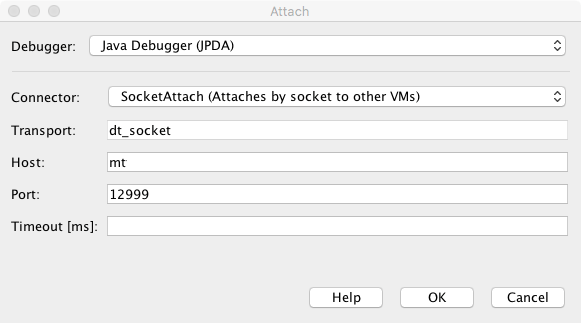

##################
JPype User Guide
##################

.. toctree::
   :maxdepth: 2

JPype Introduction
******************
JPype is a Python module to provide full access to Java from within Python.
Unlike Jython, JPype does not achieve this by re-implementing Python, but
instead by interfacing both virtual machines at the native level. This
shared memory based approach achieves good computing performance, while
providing the access to the entirety of CPython and Java libraries.
This approach allows direct memory access between the two machines,
implementation of Java interfaces in Python, and even use of Java threading.

JPype Use Cases
===============

Here are three typical reasons to use JPype.

- Access to a Java library from a Python program (Python oriented)
- Visualization of Java data structures (Java oriented)
- Interactive Java and Python development including scientific and mathematical
  programming.

Let's explore each of these options.

Case 1: Access to a Java library
--------------------------------

Suppose you are a hard core Python programmer.  You can easily use lambdas,
threading, dictionary hacking, monkey patching, been there, done that.  You are
hard at work on your latest project but you just need to pip in the database
driver for your customers database and you can call it a night.  Unfortunately,
it appears that your customers database will not connect to the Python database
API.  The whole thing is custom and the customer isn't going to supply you with
a Python version.  They did send you a Java driver for the database but fat
lot of good that will do for you.

Stumbling through the internet you find a module that says it can natively
load Java packages as Python modules.  Well, it's worth a shot...

So first thing the guide says is that you need to install Java and set up
a ``JAVA_HOME`` environment variable pointing to the JRE.  Then start the
JVM with classpath pointed to customers jar file. The customer sent over
an example in Java so you just have to port it into Python.

.. code-block:: java

  package com.paying.customer;

  import com.paying.customer.DataBase

  public class MyExample {
     public void main(String[] args) {
       Database db = new Database("our_records");
       try (DatabaseConnection c = db.connect())
       {
          c.runQuery();
          while (c.hasRecords())
          {
            Record record = db.nextRecord();
            ...
          }
       }
    }
  }

It does not look too horrible to translate.  You just need to look past all
those pointless type declarations and meaningless braces.  Once you do, you
can glue this into Python and get back to what you really love, like performing
dictionary comprehensions on multiple keys.

You glance over the JPype quick start guide.  It has a few useful patterns...
set the class path, start the JVM, remove all the type declarations, and you are done.

.. code-block:: python

   # Boiler plate stuff to start the module
   import jpype
   import jpype.imports
   from jpype.types import *

   # Launch the JVM
   jpype.startJVM(classpath=['jars/database.jar'])

   # import the Java modules
   from com.paying.customer import DataBase

   # Copy in the patterns from the guide to replace the example code
   db = Database("our_records")
   with db.connect() as c:
       c.runQuery()
       while c.hasRecords():
           record = db.nextRecord()
           ...

Launch it in the interactive window.  You can get back to programming in Python
once you get a good night sleep.

Case 2: Visualization of Java structures
----------------------------------------

Suppose you are a hard core Java programmer.  Weakly typed languages are for
wimps, if it isn't garbage collected it is garbage.  Unfortunately your latest
project has suffered a nasty data structure problem in one of the threads.  You
managed to capture the data structure in a serialized form but if you could just
make graph and call a few functions this would be so much easier.  But  the
interactive Java shell that you are using doesn't really have much in the way of
visualization and you don't have time to write a whole graphing applet just to
display this dataset.

So poking around on the internet you find that Python has exactly the
visualization that you need for the problem, but it only runs in CPython.  So
in order to visualize the structure, you need to get it into Python, extract
the data structures and, send it to the plotting routine.

You install conda, follow the install instructions to connect to conda-forge,
pull JPype1, and launch the first Python interactive environment that appear to
produce a plot.

You get the shell open and paste in the boilerplate start commands, and load
in your serialized object.

.. code-block:: python

   import jpype
   import jpype.imports

   jpype.startJVM(classpath = ['jars/*', 'test/classes'])

   from java.nio.file import Files, Paths
   from java.io import ObjectInputStream

   with Files.newInputStream(Paths.get("myobject.ser")) as stream:
       ois = ObjectInputStream(stream)
       obj = ois.readObject()

   print(obj)  # prints org.bigstuff.MyObject@7382f612

It appears that the structure is loaded.  The problematic structure requires you
call the getData method with the correct index.

.. code-block:: python

   d = obj.getData(1)

   > TypeError: No matching overloads found for org.bigstuff.MyObject.getData(int),
   > options are:
          public double[] org.bigstuff.MyObject.getData(double)
          public double[] org.bigstuff.MyObject.getData(int)

Looks like you are going to have to pick the right overload as it can't
figure out which overload to use.  Darn weakly typed language, how to get
the right type in so that you can plot the right data.  It says that
you can use the casting operators.

.. code-block:: python

   from jpype.types import *
   d = obj.getData(JInt(1))
   print(type(d))  # prints double[]

Great. Now you just need to figure out how to convert from a Java array into
something our visualization code can deal with.  As nothing indicates that
you need to convert the array, you just copy out of the visualization tool
example and watch what happens.

.. code-block:: python

   import matplotlib.pyplot as plt
   plt.plot(d)
   plt.show()

A graph appears on the screen.  Meaning that NumPy has not issue dealing with
Java arrays.  It looks like ever 4th element in the array is zero.
It must be the PR the new guy put in.  And off you go back to the wonderful
world of Java back to the safety of curly braces and semicolons.

Case 3: Interactive Java
------------------------

Suppose you are a laboratory intern running experiments at Hawkins National
Laboratory.  (For the purpose of this exercise we will ignore the fact that
Hawkins was shut down in 1984 and Java was created in 1995).  You have the test
subject strapped in and you just need to start the experiment.  So you pull up
Jupyter notebook your boss gave you and run through the cells.  You need to
add some heart wave monitor to the list of graphed results.

The relevant section of the API for the Experiment appears to be

.. code-block:: java

  package gov.hnl.experiment;

  public interface Monitor {
     public void onMeasurement(Measurement measurement);
  }

  public interface Measurement {
     public double getTime();
     public double getHeartRate();
     public double getBrainActivity();
     public double getDrugFlowRate();
     public boolean isNoseBleeding();
  }

  public class Experiment {
     public void addCondition(Instant t, Condition c);
     public void addMoniter(Monitor m);
     public void run();
  }

The notebook already has all the test conditions for the experiment set up
and the JVM is started, so you just need to implement the monitor.

Based on the previous examples, you start by defining a monitor class

.. code-block:: python

  from jpype import JImplements, JOverride
  from gov.hnl.experiment import Monitor

  @JImplements(Monitor)
  class HeartMonitor:
      def __init__(self):
          self.readings = []
      @JOverride
      def onMeasurement(self, measurement):
          self.readings.append([measurement.getTime(), measurement.getHeartRate()])
      def getResults(self):
          return np.array(self.readings)

There is a bit to unpack here.  You have implemented a Java class from within Python.
The Java implementation is simply an ordinary Python class which has be
decorated with ``@JImplements`` and ``@JOverride``.  When you forgot to place
the ``@JOverride``, it gave you the response::

  NotImplementedError: Interface 'gov.hnl.experiment.Monitor' requires
  method 'onMeasurement' to be implemented.

But once you added the ``@JOverride``, it worked properly.  The subject appears
to be getting impatient so you hurry up and set up a short run to make sure it
is working.

.. code-block:: python

  hm = HeartMonitor()
  experiment.addMonitor(hm)
  experiment.run()
  readings = hm.getResults()
  plt.plot(readings[:,0], readings[:,1)
  plt.show()

To your surprise, it says unable to find method addMonitor with an error message::

  AttributeError: 'gov.hnl.experiment.Experiment' object has no attribute 'addMonitor'

You open the cell and type ``experiment.add<TAB>``.  The line completes with
``experiment.addMoniter``.  Whoops, looks like there is typo in the interface.
You make a quick correction and see a nice plot of the last 30 seconds pop up
in a window.  Job well done, so you set the runtime back to one hour.  Looks
like you still have time to make the intern woodlands hike and forest picnic.
Though you wonder if maybe next year you should sign up for another laboratory.
Maybe next year, you will try to sign up for those orbital lasers the President
was talking about back in March.  That sounds like real fun.

(This advanced demonstration utilized the concept of Proxies_ and
`Code completion`_)

The JPype Philosophy
====================

JPype is designed to allow the user to exercise Java as fluidly as
possible from within Python.  We can break this down into a few specific
design goals.

- Make Java appear Pythonic.  Make it so a Python programmer feels
  comfortable making use of Java concepts.  This means making use of Python
  concepts to create very Python looking code and at times bending Python
  concepts to conform to Java's expectations.

- Make Python appear like Java.  Present concepts from Java with a syntax
  that resembles Java so that Java users can work with Python without a huge
  learning curve.

- Present everything that Java has to offer to Python.  Every
  library, package, and Java feature if possible should be accessible.
  The goal of bridge is to open up places and not to restrict flow.

- Keep the design as simple as possible. Mixing languages is already complex
  enough so don't required the user to learn a huge arsenal of unique methods.
  Instead keep it simple with well defined rules and reuse
  these concepts.  For example, all array types originate from JArray, and
  thus using one can also use isinstance to check if a class is an array
  type.  Rather than introducing factory that does a similar job to an
  existing one, instead use a keyword argument on the current factory.

- Favor clarity over performance.  This doesn't mean not trying to optimize
  paths, but just as premature optimization is the bane of programmers,
  requiring writing to maximize speed is a poor long term choice, especially
  in a language such as Python where weak typing can promote bit rot.

- If a new method has to be introduced, make it look familiar.
  Java programmers look to a method named "of" to convert to a type on
  factories such as a Stream, thus ``JArray.of`` converts a Python NumPy array
  to Java.  Python programmers expect that memory backed objects can be converted
  into bytes for rapid transfer using a memory view, thus
  ``memoryview(array)`` will perform that task.

- Provide an obvious way for both Python and Java programmers to perform tasks.
  On this front JPype and Python disagree.  In Python's philosophy there should
  be one -- and preferably only one -- obvious way to do things.  But we
  are bridging two worlds and thus obviousness is in the eye of the beholder.

The end result is that JPype has a small footprint while providing
access to Java (and other JVM based languages) with a minimum of effort.

Languages other than Java
=========================

JPype is primarily focused on providing the best possible wrapper for Java
in Python.  However, the Java Virtual Machine (JVM) is used for many popular
languages such a Kotlin and Scala.  As such JPype can be used for any language
which used the JVM.

That said, each language has its own special properties that tend to be
represented in different ways.  If you would like JPype fully to operate on your
particular language the following is required.

- Set up a test bench for your language under the test directory.  Use ivy
  to pull in the required jar files required to run it and exercise each of
  the required language features that need to be exercised.

- Write a language specific quick start guide for your language defining
  how things should appear in both your language of choice and within Python
  highlighting those things that are different from how Java.

- Set up a test harness that exercises your language for each language feature
  and place a setup script like ``test_java`` that builds the harness.

Alternatives
============

JPype is not the only Python module of its kind that acts as a bridge to
Java.  Depending on your programming requirements, one of the alternatives
may be a better fit.  Specifically JPype is designed for clarity and high
levels of integration between the Python and Java virtual machine.  As such
it makes use of JNI and thus inherits all of the benefits and limitations
that JNI imposes.  With JPype, both virtual machines are running in the
same process and are sharing the same memory space and threads.  JPype can
thus intermingle Python and Java threads and exchange memory quickly.  But by
extension you can't start and stop the JVM machine but instead must keep
both machines throughout the lifespan of the program.  High integration means
tightly coupled and thus it embodies the musketeers motto.  If Python crashes,
so does Java as they only have one process to live in.

A few alternatives with different philosophies and limitations are given in the
following section.  Please take my review comments with the appropriate grain of
salt.  When I was tasked with finding a replacement for Matlab Java integration
for our project test bench, I evaluated a number of alternatives
Python bridge codes.  I selected JPype primarily because it presented
the most integrated API and documentation which would be suitable for getting
physicists up to speed quickly.  Thus your criteria may yield a different
selection.  JPype's underlying technology was underwhelming so I have had
the pleasure of many hours reworking stuff under the hood.

For more details on what you can't do with JPype, please see Limitations_.

`Jython <https://jython.org/>`_
-------------------------------

Jython is a reimplementation of Python in Java.  As a result it has much lower
costs to share data structures between Java and Python and potentially much
higher level of integration.  Noted downsides of Jython are that it has lagged
well behind the state of the art in Python; it has a limited selection of
modules that can be used; and the Python object thrashing is not particularly
well suited for the Java virtual machine, leading to some known performance issues.

`Py4J <https://py4j.org/>`_
---------------------------

Py4J uses a remote tunnel to operate the JVM.  This has the advantage that
the remote JVM does not share the same memory space and multiple JVMs can
be controlled.  It provides a fairly general API, but the overall integration
to Python is as one would expect when operating a remote channel operating
more like an RPC front-end.  It seems well documented and capable.  Although
I haven't done benchmarking, a remote access JVM will have a
transfer penalty when moving data.

`Jep <https://github.com/ninia/jep>`_
-------------------------------------

Jep stands for Java embedded Python.  It is a mirror image of JPype.  Rather
that focusing on accessing Java from within Python, this project is geared
towards allowing Java to access Python as sub-interpreter.  The syntax for
accessing Java resources from within the embedded Python is quite similar
with support for imports.  Notable downsides are that although Python supports
multiple interpreters many Python modules do not, thus some of the advantages
of the use of Python many be hard to realize.  In addition, the documentation
is a bit underwhelming thus it is difficult to see how capable it is from the
limited examples.

`PyJnius <https://github.com/kivy/pyjnius>`_
--------------------------------------------

PyJnius is another Python to Java only bridge.  Syntax is somewhat similar to
JPype in that classes can be loaded in and then have mostly Java native syntax.
Like JPype, it provides an ability to customize Java classes so that they
appear more like native classes.  PyJnius seems to be focused on Android.  It
is written using Cython .pxi files for speed.  It does not include a method to
represent primitive arrays, thus Python list must be converted whenever an
array needs to be passed as an argument or a return.  This seems pretty
prohibitive for scientific code.  PyJnius appears is still in active development.

`Javabridge <https://github.com/CellProfiler/python-javabridge/>`_
------------------------------------------------------------------

Javabridge is direct low level JNI control from Python. The integration level
is quite low on this, but it does serve the purpose of providing the JNI API
to Python rather than attempting to wrap Java in a Python skin.  The downside
being of course you would really have to know a lot of JNI to make effective
use of it.

`jpy <https://github.com/bcdev/jpy>`_
-------------------------------------

This is the most similar package to JPype in terms of project goals.  They have
achieved more capabilities in terms of a Java from Python than JPype which does
not support any reverse capabilities.  It is currently unclear if this project
is still active as the most recent release is dated 2014.  The integration
level with Python is fairly low currently though what they do provide is a
similar API to JPype.

`JCC <https://lucene.apache.org/pylucene/jcc/>`_
------------------------------------------------
JCC is a C++ code generator that produces a C++ object interface wrapping a Java
library via Java's Native Interface (JNI). JCC also generates C++ wrappers that
conform to Python's C type system making the instances of Java classes directly
available to a Python interpreter.  This may be handy if your goal is not
to make use of all of Java but rather have a specific library exposed to Python.

`VOC <https://beeware.org/project/projects/bridges/voc/>_`
----------------------------------------------------------
A transpiler that converts Python bytecode into Java bytecode part of the
BeeWare project.  This may be useful if getting a smallish piece of
Python code hooked into Java.  It currently list itself as early development.
This is more in the reverse direction as its goals are making Python code
available in Java rather providing interaction between the two.

`p2j <https://github.com/chrishumphreys/p2j>`_
----------------------------------------------

This lists itself as "A (restricted) python to java source translator".
Appears to try to convert Python code into Java.  Has not been actively
maintained since 2013.  Like VOC this is primilarly for code translation rather
that bridging.

About this guide
================

The JPype User Guide is targeted toward programmers who are strong in either
Python who wish to make use of Java or those who are strong with Java and are
looking to use Python as a Java development tool.  As such we will compare and
contrast the differences between the languages and provide examples suitable
to help illustrate how to translate from one language to the other on the
assumption that being strong in one language will allow you to easily grasp
the corresponding relations in the other.  If you don't have a strong
background in either language an appropriate language tutorial may be
necessary.

JPype will hide virtually all of the JNI layer such that there is no direct
access to JNI concepts.  As such attempting to use JNI knowledge will likely
lead to incorrect assumptions such as incorrectly attempting to use JNI
naming and method signatures in the JPype API.  Where JNI limitations do
appear we will discuss the consequences imposed in programming.  No knowledge
of JNI is required to use this guide or JPype.

JPype only works with Python 3, thus all examples will be using Python
version 3 syntax and assume the use of the Python 3 new style object model.
The naming conventions of JPype follow the Java rules rather than those of
Python.  This is a deliberate choice as it would be dangerous to try to
mangle Java method and field names into Python conventions and risk
a name collision.  Thus if method must have Java conventions then the rest
of the module should follow the same pattern for consistency.

Getting JPype started
---------------------

This document holds numerous JPype examples.  For the purposes of clarity
the module is assumed to have been started with the following command

.. code-block:: python

  # Import the module
  import jpype

  # Allow Java modules to be imported
  import jpype.imports

  # Import all standard Java types into the global scope
  from jpype.types import *

  # Import each of the decorators into the global scope
  from jpype import JImplements, JOverride, JImplementationFor

  # Start JVM with Java types on return
  jpype.startJVM(convertStrings=False)

  # Import default Java packages
  import java.lang
  import java.util

This is not the only style used by JPype users.  Some people feel it is
best to limit the number for symbols in the global scope and instead
start with a minimalistic approach.

.. code-block:: python

  import jpype as jp                 # Import the module
  jp.startJVM(convertStrings=False)  # Start the module

Either style is usable and we do not wish to force any particular style on the
user.  But as the extra ``jp.`` tends to just clutter up the space and implies
that JPype should always be used as a namespace due to namespace conflicts, we
have favored the global import style.  JPype only exposes 40 symbols total
including a few deprecated functions and classes. The 13 most commonly used
Java types are wrapped in a special module ``jpype.types`` which can be used to
import all for the needed factories and types with a single command without
worrying about importing potentially problematic symbols.

We will detail the starting process more later in the guide.  See
`Starting the JVM`_.

JPype Concepts
***************

At its heart, JPype is about providing a bridge to use Java within Python.
Depending on your perspective that can either be a means of accessing Java
libraries from within Python or a way to use Java using Python syntax for
interactivity and visualization.  This mean not only exposing a limited API but
instead trying to provide the entirety of the Java language with Python.

To do this, JPype maps each of the Java concepts to the nearest concept in
Python wherever they are similar enough to operate without confusion.  We have
tried to keep this as Pythonic as possible, though it is never without some
rough edges.

Python and Java share many of the same concepts.  Types, class, objects,
function, methods, and members.  But in other places they are rather different.
Python lacks casting, type declarations, overloading, and many other features of
a strongly typed language, thus we must expose those concepts into the Python
syntax as best we can.  Java for instance has class annotation and Python
have class decorators.  Both serve the purpose of augmenting a class with
further information, but are very different in execution.

We have broken the mapping down in nine distinct concepts.  Some
elements serve multiple functions.

Type Factories
  These are meta classes that allow one to declare a particular
  Java type in Python.  The result of type factories are wrapper classes.
  (JClass_ and JArray_)  Factories also exist to implement Java classes
  from within Python (JProxy_)

Meta Classes
  These are classes to describe different properties of Java classes such as
  to check if a class is an Interface. (JInterface_)

Base Classes
  These are JPype names for Java classes in Python that exist without importing
  any specific Java class.  Concepts such as Object, String, and Exception are
  defined and can be used in instance checks.  For example, to catch all Java
  exceptions regardless of type, we would catch ``JException``.  These are mainly
  for convenience though they do have some extra functionality.  Most of these
  functions are being phased out in favor of Java syntax.  For example,
  catching ``java.lang.Throwable`` will catch everything that ``JException``
  will catch.  (Jarray_, JObject_, JString_, and JException_)

Wrapper Classes
  These correspond to each Java class.  Thus can be used to access static
  variables, static methods, cast, and construct object.  They are used
  wherever a Java type would be used in the Java syntax such as creating an
  array or accessing the class instance.  These class wrappers are customized in
  Python to allow a direct mapping from Java concepts to Python one.  These
  are all created dynamically corresponding to each Java class.  For most
  of this document we will refer to these simply as a "class".
  (`java.lang.Object`_, `java.lang.String`_, etc) Many wrappers
  are customized to match Python abstract base classes ABC
  (`java.util.List`_, `java.util.Map`_)

Object Instances
  These are Java objects.  They operate just like Python objects with
  Java public fields mapped to Python attributes and Java methods to
  Python methods.  For this document we will refer to an object instance
  simply as an "object".  The object instance is split into two halves.  The
  Python portion is referred to as the "handle" that points the Java
  "instance".  The lifetime of the "instance" is tied to the handle thus
  Java objects do not disappear until the Python handle is disposed of.
  Objects can be cast_ to match the required type and hold methods_ and
  fields.

`Primitive types`_
  Each of the 8 Java primitive types are defined.  These are used to cast
  to a Java type or to construct arrays.  (`JBoolean`_, `JChar`_, `JByte`_,
  `JShort`_, `JInt`_, `JLong`_, `JFloat`_, and `JDouble`_)

Decorators
  Java has a number of keywords such as extending a class or implementing an
  interface.  Those pieces of meta data can't directly be expressed with the
  Python syntax, but instead have been been expressed as annotations that
  can be placed on classes or functions to augment them with Java specific
  information. (`@JImplements`_, `@JOverride`_, `@JImplementationFor`_)

Mapping Java syntax to Python
  Many Java concepts like try with resources can be mapped into Python
  directly (as the ``with`` statement), or Java try, throw, catch mapping to
  Python try, raise, except.  Others such as synchronize do not have an exact
  Python match.  Those have instead been mapped to special functions
  that interact with Python syntax..
  (synchronized_, `with`, `try`, import_)

JVM control functions
  The JVM requires specific actions corresponding to JNI functions in order
  to start, shutdown, and define threading behavior.  These top level control
  functions are held in the ``jpype`` module. (startJVM_, shutdownJVM_)

We will detail each of these concepts in greater detail in the later sections.

Name mangling
=============

When providing Java package, classes, methods, and fields to Python,
there are occasionally naming conflicts.  For example, if one has a method
called ``with`` then it would conflict with the Python keyword ``with``.
Wherever this occurs, JPype renames the offending symbol with a trailing
under bar.  Java symbols with a leading or trailing under bars are consider to
be privates and may not appear in the JPype wrapper entirely with the exception
of package names.

The following Python words will trigger name mangling of a Java name:

=========== =========== ============= =========== ==========
``False``   ``None``    ``True``      ``and``     ``as``
``async``   ``await``   ``def``       ``del``     ``elif``
``except``  ``exec``    ``from``      ``global``  ``in``
``is``      ``lambda``  ``nonlocal``  ``not``     ``or``
``pass``    ``print``   ``raise``     ``with``    ``yield``
=========== =========== ============= =========== ==========

JPype Types
***********

Both Java and Python have a concept of a type.  Every variable refers to an
object which has a defined type.  A type defines the data that the variable is
currently holding and how that variable can be used.  In this chapter we will
learn how Java and Python types relate to one another, how to create import
types from Java, and how to use types to create Java objects.

Stay strong in a weak language
==============================

Before we get into the details of the types that JPype provides, we first need
to contrast some of the fundamental language differences between Java and
Python.  Python is inherently a weakly typed language.  Any variable can take
any type and the type of a particular variable can change over the
lifetime of a program.  Types themselves can be mutable as you can patch an
existing type to add new behaviors.  Python methods can in principle take any
type of object as an argument, however if the interface is limited it will produce
a TypeError to indicate a particular argument requires a specific type.  Python
objects and classes are open.  Each class and object is basically a dictionary
storing a set of key value pairs.  Types implemented in native C are often more
closed and thus can't have their method dictionaries or data members altered
arbitrarily.  But subject to a few restrictions based implementation, it is
pretty much the wild west.

In contrast, Java is a strongly typed language.  Each variable can only take
a value of the specified class or a class that derives from the specified
class.  Each Java method takes only a specific number and type of arguments.
The type and number are all checked at compile type to ensure there is
little possibility of error.  As each method requires a specific number and type
of arguments, a method can be overloaded by having two different
implementations which take a different list of types sharing the same method
name. A primitive variable can never hold an object and it can only be converted
to or from other primitive types unless it is specifically cast to that type.
Java objects and classes are completely closed.  The methods and fields for a
particular class and object are defined entirely at compile time.  Though it is
possible create classes with a dictionary allowing expansion, this is not the
Java norm and no standard mechanism exists.

Thus we need to introduce a few Java terms to the Python vocabulary.  These are
"conversion" and "cast".

Java conversions
----------------

A conversion is a permitted change from an object of one type to another.
Conversions have three different degrees.  These are: exact, derived, implicit,
and explicit.

Exact conversions are those in which the type of an object is identical.  In
Java each class has only one definition thus there is no need for an exact
conversion.  But when dealing with Python we have objects that are effectively
identical for which exact conversion rules apply.  For example, a Java string
and a Python string both bind equally well to a method which requires a string,
thus this is an exact conversion for the purposes of bind types.

The next level of conversion is derived.  A derived class is one which is a
descends from a required type.  It is better that implicit but worse than
exact.  If all of the types in a method match are exact or derived then it will
override a method in which one argument is implicit.

The next level of conversion is implicit.  An implicit conversion is one that
Java would perform automatically.  Java defines a number of other conversions
such as converting a primitive to a boxed type or from a boxed type back to a
primitive as implicit conversions.  Python conversions defined by the user are
also considered to be implicit.

Of course not every cast is safe to perform.  For example, converting an object
whose type is currently viewed as a base type to a derived type is not
performed automatically nor is converting from one boxed type to another.  For
those operations the conversion must be explicitly requested, hence these are
explicit conversions.   In Java, a cast is requested by placing the type name
in parentheses in front of the object to be cast.  Python does not directly
support Java casting syntax. To request an explicit conversion an object must
be "cast" using a cast operator @.   Overloaded methods with an explicit
argument will not be matched.  After applying an explicit cast, the match
quality can improve to exact or derived depending on the cast type. 

Not every conversion is possible between Java types.  Types that cannot be
converted are considerer to be conversion type "none".

Details on the standard conversions provided by JPype are given in the section
`Type Matching`_.

.. _cast:

Java casting
------------

To access a casting operation we use the casting ``JObject`` wrapper.  
For example, ``JObject(object, Type)`` would produce a copy with specificed type.
The first argument is the object to convert and
the second is the type to cast to.  The second argument should always be a Java
type specified using a class wrapper, a Java class instance, or a string.
Casting will also add a hidden class argument to the resulting object such that
it is treated as the cast type for the duration of that variable lifespan.
Therefore, a variable create by casting is stuck as that type and cannot revert
back to its original for the purposes of method resolution.

The object construction and casting are sometimes a bit blurry.  For example,
when one casts a sequence to a Java list, we will end up constructing a new
Java list that contains the elements of the original Python sequence.  In
general JPype constructors only provide access the Java constructor methods
that are defined in the Java documentation.  Casting on the other hand is
entirely the domain of whatever JPype has defined including user defined casts.

As ``JObject`` syntax is long and does not look much like Java syntax, the
Python matmul operator is overloaded on JPype types such that one can use the
``@`` operator to cast to a specific Java type.   In Java, one would write
``(Type)object`` to cast the variable ``object`` to ``Type``.  In Python, this
would be written as ``Type@object``.   This can also be applied to array types
``JLong[:]@[1,2,3]``, collection types ``Iterable@[1,2,3]`` or Java functors
``DoubleUnaryOperator@(lambda x:x*2)``.  The result of the casting operator
will be a Java object with the desired type or raise a ``TypeError`` if the
cast or conversion is not possible.   For Python objects, the Java object will
generally be a copy as it is not possible to reflect changes in an array back
to Python.  If one needs to retrieve the resulting changes keep a copy of the
converted array before passing it.  For an existing Java object, casting
changes the resolution type for the object.  This can be very useful when
trying to call a specific method overload.   For example, if we have a Java
``a=String("hello")`` and there were an overload of the method ``foo`` between
``String`` and ``Object`` we would need to select the overload with
``foo(java.lang.Object@a)``.  

.. _JObject:

Casting is performed through the Python class ``JObject``.  JObject is called
with two arguments which are the object to be cast and the type to cast too.
The cast first consults the conversion table to decide if the cast it permitted
and produces a ``TypeError`` if the conversion is not possible.

``JObject`` also serves as a abstract base class for testing if an object
instance belongs to Java.  All objects that belong to Java will return
true when tested with ``isinstance``.  Like Python's sequence, JObject is an
abstract base class.  No classes actual derive from ``JObject``.

.. _null:

Of particular interest is the concept of Java ``null``.  In Java, null is a
typeless entity which can be placed wherever an object is taken to
indicate that the object is not available.  The equivalent concept in Python is
``None``.  Thus all methods that accept any object type that permit a null will
accept None as an augment with implicit conversion.  However, sometime it is
necessary to pass an explicit type to the method resolution.  To achieve this
in JPype use ``Type@None`` which will create a null pointer with the
desired type.  To test if something is null we have to compare the handle to
None.  This unfortunately trips up some code quality checkers.  The idiom in
Python is ``obj is None``, but as this only matches things that Python
considers identical, we must instead use ``obj==None``.

Casting ``None`` is use to specify types when calling between overloads
with variadic arguments such as ``foo(Object a)`` and ``foo(Object... many)``.
If we want to call ``foo(None)`` is is ambiguous whether we intend to call the
first with a null object or the second with a null array.  We can resolve the
ambiguity with ``foo(java.lang.Object@None)`` or
``foo(java.lang.Object[:]@None)``

Type enforcement appears in three different places within JPype.  These are
whenever a Java method is called, whenever a Java field is set, and whenever
Python returns a value back to Java.

.. _methods:

Method resolution
=================

Because Java supports method overloading and Python does not, JPype wraps Java
methods as a "method dispatch".  The dispatch is a collection of all of the
methods from class and all of its parents which share the same name.  The job
of the dispatch is chose the method to call.

Enforcement of the strong typing of Java must be performed at runtime within
Python.  Each time a method is invoked, JPype must match against the list of
all possible methods that the class implements and choose the best
possible overload.  For this reason the methods that appear in a JPype class
will not be the actual Java methods, but rather a "dispatch" whose job is
deciding which method should be called based on the type of the provided
arguments.

If no method is found that matches the provided arguments, the method dispatch
will produce a ``TypeError``.  This is the exact same outcome that Python uses
when enforcing type safety within a function.  If a type doesn't match a
``TypeError`` will be produced.

Dispatch example
----------------

When JPype is unable to decide which overload of a method to call, the user
must resolve the ambiguity.  This is where casting comes in.

Take for example the ``java.io.PrintStream`` class. This class has a variant of
the print and println methods!

So for the following code:

.. code-block:: python

  java.lang.System.out.println(1)

JPype will automatically choose the ``println(long)`` method, because the Python
int matches exactly with the Java long, while all the other numerical types
are only "implicit" matches. However, if that is not the version you
wanted to call you must cast it.  In this case we will use a primitive
type to construct the correct type.

Changing the line thus:

.. code-block:: python

  java.lang.System.out.println(JByte(1)) # <--- wrap the 1 in a JByte

This tells JPype to choose the byte version. When dealing with Java types, JPype follows
the standard Java matching rules.  Types can implicitly grow to larger types
but will not shrink without an explicit cast.

Primitive Types
===============

Unlike Python, Java makes a distinction between objects and primitive data
types.  Primitives represent the minimum data that can be manipulated by a
computer.  These stand in contrast to objects which have the ability to contain any
combination of data types and object within themselves, and can be inherited
from.

Java primitives come in three flavors.  The logical primitive ``boolean`` can
only take the logical value true and false.  The textual primitive ``char``
represents one character in a string.  Numerical primitives are intended for
fixed point or floating point calculations.  Numerical primitives come in many
sizes depending on how much storage is required.  In Java, integer numerical
primitives are always signed and thus can only reach half their range in terms
of bits up or down relative to their storage size.

JPype has mapped each of the primitive types into Python classes.  To avoid
conflicts with Python, JPype has named each primitive with a capital letter
``J`` followed by the primitive name starting with an upper case letter.

.. _JBoolean:

JBoolean
  A boolean is the logical primitive as it can only take values ``True`` and
  ``False``.  It should properly be an extension of the Python concept ``bool``
  but that type is not extendable.  Thus instead it must inherit from ``int``.
  This type is rarely seen in JPype as the values ``True`` and ``False``
  are considered an exact match to ``JBoolean`` argument.  Methods which
  return a ``JBoolean`` will always return a Python ``bool`` rather than
  a Java primitive type.

.. _JChar:

JChar
  A character is the textual primitive that corresponds to exactly one character
  in a string.  Or at least that was the concept at the time.  Java characters
  can only represent 16 bits.  But there are currently 143,924
  defined characters in Unicode.  Thus, there are certain characters that
  can only be represented as two Unicode characters.  The textual primitives
  are not intended to perform numerical functions, but are instead encoded.
  As per the old joke, what does `1` plus `1` equal?  Which of course the
  correct answer is `b`.  As such characters should not be treated as just
  another unsigned short.  Python has no concept of a textual only type.
  Thus when returning a character type, we instead return a string length 1.
  ``JChar`` supports the Java numerical operations, but just as in Java it will
  automatically promote to a Python ``int`` when used in a numerical operation.
  There are of course lots of useful mathematical operations that can be
  performed on textual primitives, but doing so risks breaking the encoding
  and can result in uninterpretable data.

.. _JByte:
.. _JShort:
.. _JInt:
.. _JLong:

JByte, Short, Int, Long
  These types represent fixed point quantities with ranges of 8, 16, 32, and
  64 bits.  Each of these type inherit from a Python ``int`` type.  A method
  or field returning an integer primitive will return a type derived from
  ``int``.  Methods accepting an integer primitive will take either an
  Java integer primitive or a Python ``int`` or anything that quacks like a
  ``int`` so long as it can be converted into that primitive range without
  truncation.

.. _JFloat:
.. _JDouble:

JFloat, JDouble
  These two types hold floating point and correspond to either single point
  (32 bit) or double point (64 bit) precision.  Python does not have a concept
  of precision and thus both of these derive from the Python type ``float``.
  As per Java rules numbers greater than the range correspond to the values
  of positive and negative infinity.  Conversions from Python types are
  ranged check and will produce a ``OverflowError`` if the value doesn't
  fit into the request types.  If an overflow error is not desired, first
  cast the value into the request size prior to calling.  Methods that return
  a Java floating point primitive will always return a value derived from
  ``float``.

The classes for Java primitives are closed and should not be extended.
As with all Java values any information attached to the Python representation
is lost when passing that value to Java.

Objects & Classes
=================

In contrast to primitive data type, objects can hold any combination of
primitives or objects.  Thus they represent structured data.  Objects can also
hold methods which operate on that data.  Objects can inherit from one another.

However unlike Python, Java objects must have a fixed structure which defines
its type.  These are referred to the object's class.  Here is a point of
confusion.  Java has two different class concepts: the class definition and the
class instance.  When you import a class or refer to a method using the class
name you are accessing the class definition.  When you call ``getClass`` on an
object it returns a class instance.  The class instance is a object whose
structure can be used to access the data and methods that define the class
through reflection.  The class instance cannot directly access the fields or
method within a class but instead provides its own interface for querying the
class.  For the purposes of this document a "class" will refer to the class
definition which corresponds to the Python concept of a class. Wherever the
Java reflection class is being referred to we will use the term "class
instance".  The term "type" is synonymous with a "class" in Java, though often
the term "type" is only used when inclusively discussing the type of primitives
and objects, while the term "class" generally refers to just the types
associated with objects.

All objects in Java inherit from the same base class ``java.lang.Object``, but
Java does not support multiple inheritance.  Thus each class can only inherit
from a single parent.  Multiple inheritance, mix-ins, and diamond pattern are
not possible in Java.  Instead Java uses the concept of an interface.  Any Java
class can inherit as many interfaces as it wants, but these interfaces may not
contain any data elements.  As they do not contain data elements there can
be no ambiguity as to what data a particular lookup.

.. _JInterface:

The meta class ``JInterface`` is used to check if a class type is an interface
using ``isinstance``.  Classes that are pure interfaces cannot be instantiated,
thus, there is not such thing as an abstract instance.  Therefore, every
Java object should have Objects cannot actual be pure interfaces.  To
represent this in Python every interface inherits ``java.lang.Object`` methods
even through it does not have ``java.lang.Object`` as a parent.  This ensures
that anonymous classes and lambdas have full object behavior.

Classes
-------

In JPype, Java classes are instances of the Python ``type`` and function like
any ordinary Python class.  However unlike Python types, Java classes are
closed and cannot be extended.  To enforce extension restrictions, all Java
classes are created from a special private meta class called
``_jpype._JClass``.  This gatekeeper ensures that the attributes of classes
cannot be changed accidentally nor extended.  The type tree of Java is fixed
and closed.

All Java classes have the following functionality.

Class constructor
  The class constructor is accessed by using the Python call syntax ``()``.
  This special method invokes a dispatch whenever the class is called
  as a function.  If an matching constructor is found a new Java instance
  is created and a Python handle to that instance is returned.  In the case
  of primitive types, the constructor creates a Java value with the exact
  type requested.

Get attribute
  The Python ``.`` operator gets an attribute from a class with a specified
  name.  If no method or field exists a ``AttributeError`` will be raised.
  For public static methods, the getattr will produce a Python descriptor which
  can be called to invoke the static method.  For public static fields, a Python
  descriptor will be produced that allows the field to be get or set depending
  on whether the field is final or not.  Public instance methods and instance
  fields will produce a function that can be applied to a Java object to
  execute that method or access the field.  Function accessors are
  non-virtual and thus they can provide access to behaviors that have been
  hidden by a derived class.

Set attribute
  In general, JPype only allows the setting of public non-final fields.  If you
  attempt to set any attribute on an object that does not correspond to a
  settable field it will produce an ``AttributeError``.  There is one exception
  to this rule.  Sometime it is necessary to attach addition private meta data to
  classes and objects.  Attributes that begin with an underbar are consider to be
  Python private attributes.  Private attributes handled by the default Python
  attribute handler allowing these attributes to be attached to to attach data to
  the Python handle.  This data is invisible to Java and it is retained only on
  the Python instance.  If an object with Python meta data is passed to Java
  and Java returns the object, the new Python handle will not contain any of the
  attached data as this data was lost when the object was passed to Java.

``class_`` Attribute
  For Java classes there is a special attribute called ``class``.  This
  is a keyword in Python so `name mangling`_ applies.  This is a class instance
  of type ``java.lang.Class``.  It can be used to access fields and methods.

Inner classes
  For methods and fields, public inner classes appear as attributes of
  the class.  These are regular types that can be used to construct objects,
  create array, or cast.

String
  The Java method ``toString`` is mapped into the Python function ``str(obj)``.

Equality
  The Java method ``equals()`` has been mapped to Python ``==`` with special
  augmentations for null pointers.  Java ``==`` is not exposed directly
  as it would lead to numerous errors.  In principle, Java ``==`` should map
  to the Python concept of ``is`` but it is not currently possible to overload
  Python in such a way to achieve the desired effect.

Hash
  The Java method ``hashCode`` is mapped to Python ``hash(obj)`` function.
  There are special augmentations for strings and nulls.  Strings will return
  the same hash code as returned by Python so that Java strings and Python
  strings produce the same dictionary lookups.  Null pointers produce the
  same hash value as None.

  Java defines ``hashCode`` on many objects including mutable ones.  Often
  the ``hashCode`` for a mutable object changes when the object is changed.
  Only use immutable Java object (String, Instant, Boxed types) as
  dictionary keys or risk undefined behavior.

Java objects are instances of Java classes and have all of the methods defined
in the Java class including static members.  However, the get attribute method
converts public instance members and fields into descriptors which act on
the object.

Now that we have defined the basics of Java objects and classes, we will
define a few special classes that operate a bit differently.

Array Classes
-------------

In Java all arrays are also objects, but they cannot define any methods beyond
a limited set of Java array operations.  These operations have been mapped into
Python to their closest Python equivalent.

Arrays also have a special type factory to produce them.  In principle
one can create an array class using ``JClass`` but the signature required
would need to use the proper name as required for the Java method
``java.lang.Class.forName``.  Instead we call the factory to create a new
type to use.

.. _JArray:

The signature for JArray is ``JArray(type, [dims=1])``.  The type argument
accepts any Java type including primitives and constructs a new array class.
This class can be used to create new instances, cast, or as the input to
the array factory.  The resulting object has a constructor method
which take either a number, which is the desired size of the array, or a
sequence which hold the elements of the array.  If the members of the
initializer sequence are not Java members then each will be converted.  If
any element cannot be converted a ``TypeError`` will be raised.

As a shortcut the ``[]`` operator can be used to specify an array type or
an array instance.   For example, ``JInt[5]`` will allocate an array instance
of Java ints with length 5.  ``JInt[:]`` will create a type instance with 
an unspecific length which can be used for the casting operator.  To create
an array instance with multiple dimensions we would use ``JInt[5,10]`` 
which would create a rectangular array which was 5 by 10.   To create a
jagged array we would substitute ``:`` for the final dimensions.  So
``JInt[5,:]`` is a length 5 array of an array of ``int[]``.  Multidimensional
array types are specificed like ``JInt[:,:,:]`` would be a Java type
``int[][][]``.  This applied to both primitive and object types.

JArray is an abstract base class for all Java classes that are produced.
Thus, one can test if something is an array class using ``issubclass``
and if Java object is an array using ``isinstance``.

Java arrays provide a few additional Python methods:

Get Item
  Arrays are of course a collection of elements.  As such array elements can
  be accessed using the Python ``[]`` operator.  For multidimensional arrays
  JPype uses Java style access with a series of index operations such
  as ``jarray[4][2]`` rather than NumPy like multidimensional access.

Get Slice
  Arrays can be accessed using a slice like a Python list.
  The slice operator is  ``[start:stop:step]``.  It should be noted that array
  slice are in fact views to the original array so any alteration to
  the slice will affect the original array.  Array slices are cloned when
  passed back to Java.  To force a clone immediately, use the ``clone`` method.
  Please note that applying the slice operator to a slice produces a new
  slice.  Thus there can sometimes be an ambiguity between multidimensional
  access and repeated slicing.

Set Item
  Array items can be set using the Python ``[]=`` operator.

Set Slice
  Multiple array items can be set using a slice assigned with a sequence.
  The sequence must have the same length as the slice.  If this condition is not
  met, an exception
  will be raised.  If the items to be transferred are a buffer,
  then a faster buffer transfer assignment will be used.  When buffer transfers
  are used individual elements are not checked for range, but instead cast
  just like NumPy.  Thus, if we have the elements we wish to assign to the
  array contained within a NumPy array named ``na`` we can transfer all of them using
  ``jarray[:] = na``.

Buffer transfer
  Buffer transfers from a Java array also work for primitive types.  Thus we
  can simply call the Python ``memoryview(jarray)`` function to create a buffer
  that can be used to transfer any portion of a Java array out.  Memory views
  of Java arrays are not writable.

For each
  Java arrays can be used as the input to a Python for statement.  To iterate
  each element use ``for elem in jarray:``.  They can also be used in
  list comprehensions.

Clone
  Java arrays can be duplicated using the method clone.  To create a copy
  call ``jarray.clone()``.  This operates both on arrays and slice views.

Length
  Arrays in Java have a defined an immutable length.  As such the
  Python ``len(array)`` function will produce the array length.  However,
  as that does not match Java expectations, JPype also adds an attribute
  for length so that Java idiom  ``jarray.length`` also works as expected.

In addition, the Java class ``JChar[]`` has some addition customizations to help
work better with string types.

Java arrays are currently missing some of the requirements to act as a
``collections.abc.Sequence``.  When working with Java arrays it is also useful
to use the Java array utilities class ``java.util.Arrays`` as it has many
methods that provide additional functionality.  Java arrays do not support any
additional mathematical operations at this time.

Creating a Java array is also required when pass by reference syntax is required.
For example, if a Java function takes an array, modifies it and we want to
retrieve those values.  In Java, all parameters are pass by value, but the contents
of a container like an array can be modified which gives the appearance of 
pass by reference.  For example.

.. code-block:: java

     public void modifies(int[] v) {
         for (int i=0; i<v.length; ++i)
              v[i]*=2;
     }

.. code-block:: python

     orig = [1,2,3]
     obj = jpype.JInt[:](orig)
     a.modifies(obj)   #  modifies the array by multiply all by 2
     orig[:] = obj     #  copy all the values back from Java to Python

If we were to call modifies on the original Python list directly, the temporary copy
would have been modified so the results would have been lost.

Buffer classes
--------------

In addition to array types, JPype also supports Java ``nio`` buffer types.
Buffers in Java come in two flavors.  Array backed buffers have no special
access.  Direct buffers are can converted to Python buffers with both
read and write capabilities.

Each primitive type in Java has its own buffer type named based on the
primitive type.  ``java.nio.ByteBuffer`` has the greatest control allowing
any type to be read and written to it.  Buffers in Java function are like
memory mapped files and have a concept of a read and write pointer which
is used to traverse the array.  They also have direct index access to their
specified primitive type.

Java buffer provide an additional Python method:

Buffer transfer
  Buffer transfers from a Java buffer works for a direct buffer.  Array backed
  buffers will raise a ``BufferError``.  Use the Python ``memoryview(jarray)``
  function to create a buffer that can be used to transfer any portion of a Java
  buffer out.  Memory views of Java buffers are readable and writable.

Buffers do not currently support element-wise access.

Boxed Classes
-------------

Often one wants to be able to place a Java primitive into a method of
fields that only takes an object.  The process of creating an object from a
primitive is referred to as creating a "boxed" object.  The resulting object is
an immutable object which stores just that one primitive.

Java boxed types in JPype are wrapped with classes that inherit from Python
``int`` and ``float`` types as both are immutable in Python.  This means that
a boxed type regardless of whether produced as a return or created explicitly
are treated as Python types. They will obey all the conversion rules
corresponding to a Python type as implicit matches.

In addition, they produce an exact match with their corresponding Java
type. The type conversion for this is somewhat looser than Java.  While Java
provides automatic unboxing of a Integer to a double primitive, JPype can
implicitly convert Integer to a Double boxed.

To box a primitive into a specific type such as to place it into a
``java.util.List`` use ``JObject`` on the desired boxed type or call
the constructor for the desired boxed type directly.  For example:

.. code-block:: python

     lst = java.util.ArrayList()
     lst.add(JObject(JInt(1)))      # Create a Java integer and box it
     lst.add(java.lang.Integer(1))  # Explicitly create the desired boxed object

JPype boxed classes have some additional functionality.  As they inherit from
a mathematical type in Python they can be used in mathematical operations.
But unlike Python numerical types they can take an addition state corresponding
to being equal to a null pointer.  The Python methods are not aware of this
new state and will treat the boxed type as a zero if the value is a null.

To test for null, cast the boxed type to a Python type explicitly and the
result will be checked.  Casting null pointer will raise a ``TypeError``.

.. code-block:: python

     b = JObject(None, java.lang.Integer)
     a = b+0      # This succeeds and a gets the value of zero
     a = int(b)+0 # This fails and raises a TypeError

Boxed objects have the following additional functionality over a normal object.

Convert to index
  Integer boxed types can be used as Python indices for arrays and other
  indexing tasks. This method checks that the value of the boxed
  type is not null.

Convert to int
  Integer and floating point boxed types can be cast into a Python integer
  using the ``int()`` method.  The resulting object is always of type ``int``.
  Casting a null pointer will raise a ``TypeError``.

Convert to float
  Integer and floating point boxed types can be cast into a Python float
  using the ``float()`` method.  The resulting object is always of type
  ``float``.  Casting a null pointer will raise a ``TypeError``.

Comparison
  Integer and floating point types implement the Python rich comparison API.
  Comparisons for null pointers only succeed for ``==`` and ``!=`` operations.
  Non-null boxed types act like ordinary numbers for the purposes of
  comparison.

Number Class
------------

The Java class ``java.lang.Number`` is a special type in Java. All numerical
Java primitives and Python number types can convert implicitly into a
Java Number.

========================== ========================
Input                      Result
========================== ========================
None                       java.lang.Number(null)
Python int, float          java.lang.Number
Java byte,   NumPy int8    java.lang.Byte
Java short,  NumPy int16   java.lang.Short
Java int,    NumPy int32   java.lang.Integer
Java long,   NumPy int64   java.lang.Long
Java float,  NumPy float32 java.lang.Float
Java double, NumPy float64 java.lang.Double
========================== ========================

Additional user defined conversion are also applied.  The primitive types
boolean and char and their corresponding boxed types are not considered to
numbers in Java.

.. _java.lang.Object:

Object Class
------------

Although all classes inherit from Object, the object class itself has special
properties that are not inherited.  All Java primitives will implicitly convert
to their box type when placed in an Object.  In addition, a number of Python
types implicitly convert to a Java object.  To convert to a different object
type, explicitly cast the Python object prior to placing in a Java object.

Here a table of the conversions:

================ =======================
Input            Result
================ =======================
None             java.lang.Object(null)
Python str       java.lang.String
Python bool      java.lang.Boolean
Python int       java.lang.Number
Python float     java.lang.Number
================ =======================

In addition it inherits the conversions from ``java.lang.Number``.
Additional user defined conversion are also applied.

.. _java.lang.String:

String Class
------------

The String class in Java is a special representation often pointing either to
a dynamically created string or to a constant pool item defined in the class.
All Java strings are immutable just like Python strings and thus these are
considered to be equivalent classes.

Because Java strings are in fact just pointers to blob of bytes they are
actually slightly less than a full object in some JVM implementation.  This is
a violation of the Object Orients (OO) principle, never take something away by
inheritance.  Unfortunately, Java is a frequent violator of that rule, so
this is just one of those exceptions you have to trip over.  Therefore, certain
operations such as using a string as a threading control with ``notify`` or ``wait``
may lead to unexpected results.  If you are thinking about using a Java string
in synchronized statement then remember it is not a real object.

Java strings have a number of additional functions beyond a normal
object.

Length
  Java strings have a length measured in the number of characters required
  to represent the string.  Extended Unicode characters
  count for double for the purpose of counting characters.  The string length
  can be determined using the Python ``len(str)`` function.

Indexing
  Java strings can be used as a sequence of characters in Python and thus
  each character can be accessed as using the Python indexing operator ``[]``.

Hash
  Java strings use a special hash function which matches the Python hash code.
  This ensures that they will always match the same dictionary keys as
  the corresponding string in Python.  The Python hash can be determined using
  the Python ``hash(str)`` function.  Null pointers are not currently handled.
  To get the actually Java hash, use ``s.hashCode()``

Contains
  Java strings implement the concept of ``in`` when using the Java method
  ``contains``.  The Java implementation is sufficiently similar that it will
  work fairly well on strings.
  For example, ``"I" in java.lang.String("team")`` would be equal to False.

  Testing other types using the ``in`` operator
  will likely raise a ``TypeError`` if Java is unable to convert the other item
  into something that can be compared with a string.

Concatenation
  Java strings can be appended to create a new string which contains the
  concatenation of the two strings.  This is mapped to the Python operator
  ``+``.

Comparison
  Java strings are compared using the Java method ``compareTo``.  This
  method does not currently handle null and will raise an exception.

For each
  Java strings are treated as sequences of characters and can be used with a
  for-loop construct and with list comprehension.  To iterate through all of the
  characters, use the Python construct ``for c in str:``.

Unfortunately, Java strings do not yet implement the complete list of
requirements to act as Python sequences for the purposes of
``collections.abc.Sequence``.

.. _JString:

The somewhat outdated JString factory is a Python class that pretends to be a
Java string type.  It has the marginal advantage that it can be imported before
the JVM is actually started.  Once the JVM is started, its class representation
is pointed to ``java.lang.String`` and can be used to construct a new string
object or to test if an object is actually a Java string using ``isinstance``.
It does not implement any of the other string methods and just serves as
convenience class.  The more capable ``java.lang.String`` can be imported
in place of JString, but only after the JVM is started.

String objects may optionally convert to Python strings when returned
from Java methods, though this option is a performance issue and can lead to
other difficulties.  This setting is selected when the JVM is started.
See `String Conversions`_ for details.

Java strings will cache the Python conversion so we only pay the conversion
cost once per string.

Exception Classes
-----------------

Both Python and Java treat exception classes differently from other objects.
Only these types may be caught as part of a try block.  Therefore, the
exceptions have a special wrapper.  Most of the mechanics of exceptions happen
under the surface.  The one difference between Python and Java is the behavior
when the argument is queried.  Java arguments can either be the string value, the exception
itself, or the internal construction key depending on how the exception came
into existence.  Therefore, the arguments to a Java exception should never be
used as their values are not guaranteed.

Java exception can report their stacktrace to Python in two different ways.  If
printed through the Python stack trace routine, Java exceptions are split
between the Python code that raised and a phantom Java ``cause`` which contains the
Java exception in Python order.  If the debugging information for the Java
source is enabled, Python may even print the Java source code lines
where the error occurred.  If you prefer Java style stack traces then print the
result from the ``stacktrace()`` method.  Unhandled exception that terminate
the program will print the Python style stack trace information.

.. _JException:

The base class ``JException`` is a special type located in ``jpype.types`` that
can be imported prior to the start of the JVM.  This serves as the equivalent
of ``java.lang.Throwable`` and contains no additional methods.  It is currently
being phased out in favor of catching the Java type directly.

Using ``jpype.JException`` with a class name as a string was supported in
previous JPype versions but is currently deprecated.  For further information
on dealing with exception, see the `Exception Handling`_ section.  To create a
Java exception use JClass or any of the other importing methods.

Anonymous Classes
-----------------

Sometimes Java will produce an anonymous class which does to have any actual
class representation.  These classes are generated when a method implements
a class directly as part of its body and they serve as a closure with access
to some of the variables that were used to create it.

For the purpose of JPype these classes are treated as their parents.  But this
is somewhat problematic when the parent is simply an interface and not an actual
object type.

Lambdas
-------

The companion of anonymous classes are lambda classes.  These are generated
dynamically and their parent is always an interface.  Lambdas are always
Single Abstract Method (SAM) type interfaces.  They can implement additional
methods in the form of default methods but those are generally not accessible
within JPype.

Inner Classes
-------------

For the most part, inner classes can be used like normal classes, with the
following differences:

- Inner classes in Java natively use $ to separate the outer class from the
  inner class. For example, inner class Foo defined inside class Bar is called
  Bar.Foo in Java, but its real native name is Bar$Foo.
- Inner classes appear as member of the containing class. Thus to access them
  import the outer class and call them as members.
- Non-static inner classes cannot be instantiated from Python code.  Instances
  received from Java code can be used without problem.

.. _import:

Importing Java classes
======================

As Java classes are remote from Python and can neither be created nor extended within
Python, they must be imported.  JPype provides three different methods for
creating classes.

The highest level API is the use of the import system.
To import a Java class, one must first import the optional module
``jpype.imports`` which has the effect of binding the Java package system
to the Python module lookup.  Once this is completed package or class can
be imported using the standard Python import system.  The import system
offers a very rich error reporting system.  All failed imports produce
an ``ImportError`` with diagnostics as to what went wrong.  Errors include
unable to find the class, unable to find a required dependency, and incorrect
Java version.

One important caveat when dealing with importing Java modules.  Python always
imports local directories as modules before calling the Java importer.  So any
directory named ``java``, ``com``, or ``org`` will hide corresponding Java
package.  We recommend against naming directories as ``java`` or top level
domain.

.. _JPackage:

The older method of importing a class is with the ``JPackage`` factory.
This factory automatically loads classes as attributes as requested.
If a class cannot be found it will produce an ``AttributeError``.  The
symbols ``java`` and ``javax`` in the ``jpype`` module are both ``JPackage``
instances.  Only public classes appear on ``JPackage`` but protected and even
private classes can be accessed by name.  Though most private classes
don't have any methods or fields that can be accessed.

.. _JClass:

The last mechanism for looking up a class is through the use of the ``JClass``
factory.  This is a low level API allowing the loading of any class available
using the forName mechanism in Java.  The JClass method can take up to three
arguments corresponding to arguments of the forName method and can be used
with alternative class loaders.  The majority of the JPype test bench uses
JClass so that the tests are only evaluating the desired functionality and not
the import system.  But this does not imply that JClass is the preferred
mechanic for importing classes.  The first argument can be a string or
a Java class instance.  There are two keyword arguments ``loader`` and
``initialize``.  The loader can point to an alternative ClassLoader which
is handy when loading custom classes through mechanisms such as over the
web.  A False ``initialize`` argument loads a class without
loading dependencies nor populating static fields.  This option is likely
not useful for ordinary users.  It was provided when calling forName was problematic
due to `caller sensitive`_ issues.

Type Matching
=============

This section provides tables documenting the JPype conversion rules.
JPype defines different levels of "match" between Python objects and Java
types. These levels are:

- **none**, There is no way to convert.
- **explicit (E)**, JPype can convert the desired type, but only
  explicitly via casting.  Explicit conversions are only execute automatically
  in the case of a return from a proxy.
- **implicit (I)**, JPype will convert as needed.
- **exact (X)**, Like implicit, but when deciding with method overload
  to use, one where all the parameters match "exact" will take precedence
  over "implicit" matches.

See the previous section on `Java Conversions`_ for details.

There are special conversion rules for ``java.lang.Object`` and ``java.lang.Number``.
(`Object Class`_ and `Number Class`_)

============== ========== ========= =========== ========= ========== ========== =========== ========= ========== =========== ========= ================== =================
Python\\Java    byte      short       int       long       float     double     boolean     char      String      Array       Object    java.lang.Object   java.lang.Class
============== ========== ========= =========== ========= ========== ========== =========== ========= ========== =========== ========= ================== =================
    int         I [1]_     I [1]_       X          I        I [3]_     I [3]_     X [8]_                                                       I [11]_
   long         I [1]_     I [1]_     I [1]_       X        I [3]_     I [3]_                                                                  I [11]_
   float                                                    I [1]_       X                                                                     I [11]_
 sequence
dictionary
  string                                                                                     I [2]_       X                                    I
  unicode                                                                                    I [2]_       X                                    I
   JByte          X                                                                                                                            I [9]_
  JShort                     X                                                                                                                 I [9]_
   JInt                                 X                                                                                                      I [9]_
   JLong                                           X                                                                                           I [9]_
  JFloat                                                      X                                                                                I [9]_
  JDouble                                                                X                                                                     I [9]_
 JBoolean                                                                           X                                                          I [9]_
   JChar                                                                                       X                                               I [9]_
  JString                                                                                                 X                                    I
  JArray                                                                                                          I/X [4]_                     I
  JObject                                                                                                         I/X [6]_    I/X [7]_         I/X [7]_
  JClass                                                                                                                                       I                  X
 "Boxed"[10]_     I          I          I          I          I          I          I                                                          I
============== ========== ========= =========== ========= ========== ========== =========== ========= ========== =========== ========= ================== =================

.. [1] Conversion will occur if the Python value fits in the Java
       native type.

.. [2] Conversion occurs if the Python string or unicode is of
       length 1.

.. [3] Java defines conversions from integer types to floating point
       types as implicit conversion. Java's conversion rules are based
       on the range and can be lossy.
       See (http://stackoverflow.com/questions/11908429/java-allows-implicit-conversion-of-int-to-float-why)

.. [4] Number of dimensions must match and the types must be
       compatible.

.. [6] Only if the specified type is a compatible array class.

.. [7] The object class is an exact match, otherwise
       implicit.

.. [8] Only the values `True` and `False` are implicitly converted to
       booleans.

.. [9] Primitives are boxed as per Java rules.

.. [10] Java boxed types are mapped to Python primitives, but will
        produce an implicit conversion even if the Python type is an exact
        match. This is to allow for resolution between methods
        that take both a Java primitve and a Java boxed type.

.. [11] Boxed to ``java.lang.Number``

Exception Handling
==================

Error handling is an important part of any non-trivial program.  All Java
exceptions occurring within Java code raise a ``jpype.JException`` which
derives from Python Exception. These can be caught either using a specific Java
exception or generically as a ``jpype.JException`` or ``java.lang.Throwable``.
You can then use the ``stacktrace()``, ``str()``, and args to access extended
information.

Here is an example:

.. code-block:: python

  try :
      # Code that throws a java.lang.RuntimeException
  except java.lang.RuntimeException as ex:
      print("Caught the runtime exception : ", str(ex))
      print(ex.stacktrace())

Multiple java exceptions can be caught together or separately:

.. code-block:: python

  try:
      # ...
  except (java.lang.ClassCastException, java.lang.NullPointerException) as ex:
      print("Caught multiple exceptions : ", str(ex))
      print(ex.stacktrace())
  except java.lang.RuntimeException as ex:
      print("Caught runtime exception : ", str(ex))
      print(ex.stacktrace())
  except jpype.JException as ex:
      print("Caught base exception : ", str(ex))
      print(ex.stacktrace())
  except Exception as ex:
      print("Caught python exception :", str(ex))

Exceptions can be raised in proxies to throw an exception back to Java.

Exceptions within the JPype core are issued with the most appropriate Python
exception type such as ``TypeError``, ``ValueError``, ``AttributeError``, or
``OSError``.

Exception aliasing
------------------

Certain exceptions in Java have a direct correspondence with existing
Python exceptions.  Rather than forcing JPype to translate these exceptions,
or forcing the user to handle Java exception types throughout the code,
we have "derived" these exceptions from their Python counter parts.  Thus,
rather than requiring special error handling for Java you can simple catch
these exceptions using the standard Python exception types.

`java.lang.IndexOutOfBoundsException`
  This exception is synonymous with the Python exception ``IndexError``.
  As many slicing or array operations in Java can produce an
  IndexOutOfBoundsException but the Python contract for slicing of an array
  should raise an ``IndexError``, this type has been customized to consider
  IndexError to be a base type.

`java.lang.NullPointerException`
  This exception is derived from the Python exception ``ValueError``.
  Numerous Java calls produce a ``NullPointerException`` and in all cases this
  would match a Python ``ValueError``.

By deriving these exceptions from Python, the user is free to catch the
exception either as a Java exception or as the more general Python exception.
Remember that Python exceptions are evaluated in order from most specific to
least.

Controlling the JVM
*******************

In this chapter, we will discuss how to control the JVM from within Python.
For the most part, the JVM is invisible to Python.  The only user controls
needed are to start up and shutdown the JVM.

.. _startJVM:

Starting the JVM
================

The first task is always to start the JVM.  The settings to the JVM
are immutable over the lifespan of the JVM.  The user settings are:
the JVM arguments, the class path used to find jars, and whether to
convert Java strings to Python strings.

Class paths
-----------

JPype supports two styles of classpaths.  The first is modeled after
Matlab the second argument style uses a list to the ``startJVM`` function.

The Matlab style uses the functions ``jpype.addClassPath`` and
``getClassPath``.  The first function adds a directory or jar file to the
search path.  Wild cards are accepted in the search.  Once all of the paths are
added to internal class path, they can be retrieved using ``getClassPath``
which takes a keyword argument ``env`` which defaults to true.  When set to
false, JPype will ignore the environment variable
``CLASSPATH`` which is normally included in the default classpath.

To use the argument style, pass all of the class paths in a list as
the keyword argument ``classpath`` to the ``startJVM``.  This classpath
method does not include the environment ``CLASSPATH``, but it does provide
a quick method to pull in a specific set of classes.  Wild cards are accepted
as the end of the path to include all jars in a given directory.

One should note that the class path can only be set prior starting the JVM.
Calls to set the class path after the JVM is started are silently ignored.
If a jar must be loaded after the JVM is started, it may be loaded using
``java.net.URLClassLoader``.  Classes loaded using a ``URLClassloader`` are
not visible to JPype imports nor to JPackage.

String conversions
------------------

The ``convertStrings`` argument defines how strings are returned by JPype.
Early in the life of this project return types were often converted to Python
types without regard to preserving the type information.  Thus strings would
automatically convert to a Python string effectively the data from Java to
Python on each return.  This was a violation of the Python philosophy that
explicit is better than implicit. This also prohibited chaining of Java string
operations as each operation would lose the Java representation and have to be
transferred back and forth.  The simple operation of trying to create a Java
string was difficult as directly calling ``java.lang.String`` constructor would
once again convert the result back to a Python string, hence the need to use
the ``JString`` factory.  There was an option to turn off the conversion of
strings, but it was never operable.  Therefore, all code written at the
time would expect Java strings to convert to Python strings on return.

Recognizing this is both a performance issue and that it made certain types of
programming prohibitive, JPype switched to having a setting requiring
applications to chose a policy at the start of operation.  This option
is a keyword argument ``convertStrings``.  The default for 0.7 is to give
the older broken behavior.  If specified as False, Java strings will act
as ordinary classes and return a Java string instance.  This string instance
can be converted by calling the Python ``str()`` function.
Failure to specify a policy will issue a warning message.

You are strongly encouraged to set convertStrings false especially when
are writing reusable Python modules with JPype.  String in JPype 0.8,
the default will to not convert strings.

Path to the JVM
---------------

In order the start the JVM, JPype requires the path to the Java shared library
typically located in the JRE installation.  This can either be specified
manually as the first argument to ``jpype.startJVM`` or by automatic search.

The automatic search routine uses different mechanisms depending on the
platform.  Typically the first mechanism is the use the environment variable
``JAVA_HOME``.  If no suitable JVM is found there, it will then search common
directories based on the platform.  On windows it will consult the registry.

You can get the JVM found during the automatic search by calling
``jpype.getDefaultJVMPath()``.

In order to use the JVM, the architecture of the JVM must match the Python
version.  A 64 bit Python can only use a 64 bit JVM.  If no suitable JVM can be
found it should raise an error. In some cases so rare, it may lead to a crash
depending on how the platform handles a failed shared library load.

Launching the JVM
-----------------

Now that we have discussed the JVM options, lets show how to put it into
practice.  Suppose that the Python script at the top level of your working
director, with a subdirectory holding all your working jars ``./lib``, and a
second directory with bare classes ``./classes``.  Java has been properly
installed with the same architecture as Python (both 64 bit in this case).

To start JPype we would execute the following:

.. code-block:: python

  import jpype
  jpype.startJVM("-ea", classpath=['lib/*', 'classes'], convertStrings=False)

Arguments that begin with a dash are passed to the JVM.  Any
unrecognized argument will raise an exception unless the keyword argument
``ignoreUnrecognized`` is set to ``True``.  Details of available arguments can
be found in the vendor JVM documentation.

The most frequent problem encountered when starting JPype is the jars failing
to be loaded.  Java is unforgiving when loading jar files.  To debug
the failures, we will need to print the loaded classpath.

Java has a method to retrieve the classpath that was used during the loading
process.

.. code-block:: python

   print(java.lang.System.getProperty('java.class.path'))

This command will print the absolute path to each of the jars that will be used
by the JVM.  Each of the jars are written out explicitly as
the JVM does not permit wild-cards. JPype has expanded each of them using
`glob`.  If an expected jar file is missing the list, then it will not be
accessable.

There is a flag to determine the current state of the JVM.  Calling
``jpype.isJVMStarted()`` will return the current state of the JVM.

Once the JVM is started, we can find out the version of the JVM.  The JVM can
only load jars and classfiles compiled for the JVM version or older.  Newer jar
files will invariably fail to load.  The JVM version can be determined using
``jpype.getJVMVersion()``.

.. _shutdownJVM:

Shutting down the JVM
=====================

At the other end of the process after all work has been performed, we will want
to shutdown the JVM to terminate the program.  This will happen automatically
and no user intervention is required.  If however, the user wants to continue
execution of Python code after the JVM is finished they can explicitly call
``jpype.shutdownJVM()``.  This can only be called from the main Python thread.
Any other thread will raise an exception.

The shutdown procedure of JPype and Java is fairly complicated.

1) JPype requests that the JVM shutdown gracefully.
2) Java waits until all non-daemon thread terminate. Thus if you did not
   send a termination to each non-daemon threads the shutdown will wait here
   until those threads complete their work.
3) Once the all threads have completed except for the main thread, the JVM
   will begin the shutdown sequence.  From this point on the JVM is in a
   crippled state limited what can happen to spawning the shutdown threads
   and completing them.
4) The shutdown will first spawn the threads of cleanup routine that was
   attached to the JVM shutdown hook in arbitrary order.  These routines
   can call back to Python and perform additional tasks.
5) Once the last of these threads are completed, JPype then shuts down the
   reference queue which dereferences held all Python resources.
6) Then JPype shuts down the type manager and frees all internal resources
   in the JPype module.
7) Last, it unloads the JVM shared library returning the memory used by the JVM.
8) Once that is complete, control is returned to Python.

All Java objects are now considered dead and cannot be reactivated. Any attempt
to access their data field will raise an exception.

Attaching a shutdown hook
-------------------------

If you have resources that need to be closed when the JVM is shutdown these
should be attached to the Java Runtime object.  The following pattern is used:

.. code-block:: python

    @JImplements(Runnable)
    class MyShutdownHook:
        @JOverride
        def run(self):
            # perform any required shutdown activities

    java.lang.Runtime.getRuntime().addShutdownHook(Thread(MyShutdownHook()))

This thread will be executed in a new thread once the main thread is
the only one remaining alive.  Care should always be taken to complete
work in a timely fashion and be aware the shutdown threads are inherently
racing with each other to complete their work.  Thus try to avoid expensive
operations on shutdown..

Debugging shutdown
-------------------

The most common failure during shutdown is the failure of an attached thread
to terminate.  There are specific patterns in Java that allow you to query
for all currently attached threads.

Customization
*************

JPype supports three different types of customizations.

The first is to adding a Python base class into a Java tree as was done with
certain exceptions.  This type of customization required private calls in JPype
and is not currently exposed to the user.

Second a Python class can be used as a template when a Java class is first
constructed to add additional functionality.  This type of customization can
be used to make a Java class appear as a native Python class. Many
of the Java collection classes have been customized to match Python
collections.

Last, Python class can be added to the implicit conversion list.  This
customizer is used to make Python types compatable with Java without
requiring the user to manually case over and over.

All customization available to the users is done through class decorators
added to Python classes or functions.

.. _@JImplementationFor:
.. _@JOverride:

Class Customizers
=================

Java wrappers can be customized to better match the expected behavior in
Python.  Customizers are defined using decorators.  Applying the annotations
``@JImplementationFor`` and ``@JOverride`` to a regular Python class will
transfer methods and properties to a Java class.  ``@JImplementationFor``
requires the class name as a string, a Java class wrapper, or Java class
instance.  Only a string can be used prior to starting the JVM.  ``@JOverride``
when applied to a Python method will hide the Java implementationallowing the
Python method to replace the Java implementation.  when a Java method is
overridden, it is renamed with an proceeding underscore to appear as a private
method.  Optional arguments to ``@JOverride`` can be used to control the
renaming and force the method override to apply to all classes that derive
from a base class ("sticky").

Generally speaking, a customizer should be defined before the first instance of
a given class is created so that the class wrapper and all instances will have
the customization.

Example taken from JPype ``java.util.Map`` customizer:

.. code-block:: python

  @_jcustomizer.JImplementationFor('java.util.Map')
  class _JMap:
      def __jclass_init__(self):
          Mapping.register(self)

      def __len__(self):
          return self.size()

      def __iter__(self):
          return self.keySet().iterator()

      def __delitem__(self, i):
          return self.remove(i)

The name of the class does not matter for the purposes of customizer though it
should be a private class so that it does not get used accidentally.
The customizer code will steal from the prototype class rather than acting as a
base class, thus, ensuring that the methods will appear on the most derived
Python class and are not hidden by the java implementations. The customizer
will copy methods, callable objects, ``__new__``, class member strings, and
properties.

.. _@JConversion:

Type Conversion Customizers
===========================

One can add a custom converter method which is called whenever a specified
Python type is passed to a particular Java type.  To specify a conversion
method add ``@JConversion`` to an ordinary Python function with the name of
Java class to be converted to and one keyword of ``exact`` or ``instanceof``.
The keyword controls how strictly the conversion will be applied.  ``exact`` is
restricted to Python objects whose type exactly matches the specified type.
``instanceof`` accepts anything that matches isinstance to the specified type
or protocol.  In some cases, the existing protocol definition will be overly
broad.  Adding the keyword argument ``excludes`` with a type or tuple of types
can be used to prevent the conversion from being applied.  Exclusions always
apply first.

User supplied conversions are tested after all internal conversions have been
exhausted and are always considered to be an implicit conversion.

.. code-block:: python

        @_jcustomizer.JConversion("java.util.Collection", instanceof=Sequence,
          excludes=str)
        def _JSequenceConvert(jcls, obj):
            return _jclass.JClass('java.util.Arrays').asList(obj)

JPype supplies customizers for certain Python classes.

========================== ==============================
Python class               Implicit Java Class
========================== ==============================
pathlib.Path               java.io.File
pathlib.Path               java.nio.file.Path
datetime.datetime          java.time.Instant
collections.abc.Sequence   java.util.Collection
collections.abs.Mapping    java.util.Map
========================== ==============================

Collections
***********

JPype uses customizers to augment Java collection classes to operate like
Python collections.  Enhanced objects include ``java.util.List``,
``java.util.Set``, ``java.util.Map``, and ``java.util.Iterator``.  These
classes generally comply with the Python API except in cases where there is a
significant name conflict and thus no special treatment is required when
handling these Java types.  Details of customizing Java classes can be
found in the previous chapter, Customization_.

This section will detail the various customization that are to applied the Java
collection classes.

Iterable
========

All Java classes that implement ``java.util.Iterable`` are customized
to support Python iterator notation and thus can be used in Python for loops
and in list comprehensions.

Iterators
=========

All Java classes that implement ``java.util.Iterator`` act as Python iterators.

Collection
==========

All Java classes that inherit from ``java.util.Collection`` have a defined
length determined by the Python ``len(obj)`` function.  As they also inherit
from Iterable, they have iterator, forech traversal, and list comprehension.

In addition, methods that take a Java collection can convert a Python
sequence into a collection implicitly if all of the elements have a
conversion into Java.  Otherwise a ``TypeError`` is raised.

.. _java.util.List:

Lists
=====

Java List classes such as ArrayList and LinkedList can be used in Python ``for``
loops and list comprehensions directly.  A Java list can be converted to a
Python list or the reverse by calling the requested type as a copy
constructor.

.. code-block:: python

     pylist = ['apple', 'orange', 'pears']

     # Copy the Python list to Java.
     jlist = java.util.ArrayList(pylist)

     # Copy the Java list back to Python.
     pylist2 = list(jlist)

Note that the individual list elements are still Java objects when converted
to Python and thus a list comprehension would be required to force Python
types if required.  Converting to Java will attempt to convert each argument
individually to Java.  If there is no conversion it will produce a
``TypeError``.  The conversion can be forced by casting to the appropriate
Java type with a list comprehension or by defining a new conversion
customizer.

Lists also have iterable, length, item deletion, and indexing.  Note that
indexing of ``java.util.LinkedList`` is supported but can have a large
performance penalty for large lists.  Use of iteration is much for efficient.

.. _java.util.Map:

Map
===

A Java classes that implement ``java.util.Map`` inherit the Python
collections.abc.Mapping interface.  As such they can be iterated, support
the indexing operator for value lookups, item deletion, length, and
support contains.

Here is a summary of their capabilities:

=========================== ================================
Action                       Python
=========================== ================================
Place a value in the map     ``jmap[key]=value``
Delete an entry              ``del jmap[key]``
Get the length               ``len(jmap)``
Lookup the value             ``v=jmap[key]``
Get the entries              ``jmap.items()``
Fetch the keys               ``jmap.key()``
Check for a key              ``key in jmap``
=========================== ================================

In addition, methods that take a Java map can implicitly convert a Python
``dict`` or a class that implements ``collections.abc.Mapping`` assuming that
all of the map entries can be converted to Java.  Otherwise a ``TypeError`` is
raised.

MapEntry
========

Java map entries unpack into a two value tuple, thus supporting iterating
through key value pairs.  Thus is useful when iterating map entries in a
for loop by pairs.

Set
===

All Java classes that implement ``java.util.Set`` implement delitem as well
as the Java collection customizations.

Enumeration
===========

All Java classes that implement ``java.util.Enumeration`` inherit Python
iterator behavior and can be used in Python for loops and list comprehensions.

Working with NumPy
******************

As one of the primary focuses of JPype is working with numerical codes such as
NumPy, there are a number of NumPy specific enhancements.  NumPy is a large
binary package and therefore JPype cannot be compiled against NumPy directly
without force it to be a requirement.  Instead of compiling against NumPy
directly, JPype implements interfaces that NumPy can recognize and use.  The
specific enhancements are the following: direct buffer transfers of primitive
arrays and buffers, direct transfer of multi dimensional arrays, buffer backed
NumPy arrays, and conversion of NumPy integer types to Java boxed types.

Transfers to Java
=================

Memory from a NumPy array can be transferred to Java in bulk.  The transfer of
a one dimensional NumPy array to Java can either be done at initialization
or by use of the Python slice operator.

Assuming we have a single dimensional NumPy array ``npa``, we can transfer
it with initialization using

.. code-block:: python

   ja = JArray(JInt)(npa)

Or we can transfer it to Java as a slice assignment.

.. code-block:: python

   ja[:] = npa

The slice operator can transfer the entire array or just a portion of it.

Multidimensional transfers to Java
==================================

Multidimensional arrays can also be transferred at initialization time.
To transfer a NumPy array to Java use the ``JArray.of`` function

.. code-block:: python

    z = np.zeros((5,10,20))
    ja = JArray.of(z)

Transfers to NumPy
==================

Java arrays can be in two forms.  Java multidimensional arrays are not
contiguous in memory.  If all of the arrays in each dimension are the same,
then the array is rectangular.  If the size of the arrays within any dimension
differ, then the array is jagged.  Jagged arrays are an array of arrays rather
than a rectangular block of memory.

NumPy arrays only hold rectangular arrays as multidimensional arrays of
primitives.  All other arrangements are a stored as a single dimensional array
of objects.  JPype can automatically transfer a rectangular array to NumPy as a
bulk transfer.  To do so JPype supports a ``memoryview`` on rectangular arrays.
Whenever a memoryview is called on a multidimensional array of primitives,
JPype verifies that it is rectangular and creates a buffer.  If it is jagged,
a ``BufferError`` is raised.  When a Java array is used as an argument to
initialize a NumPy array, it creates a ``memoryview`` so that all of the memory
can be transferred in bulk.

Buffer backed NumPy arrays
==========================

Java direct buffers provide access between foreign memory and Java.
This access bypasses the JNI layer entirely, permitting Java and Python to
operate on a memory space with native speed.  Java direct buffers are not under
the control of the garbage collector and thus can result in memory leaks and
memory exhaustion if not used carefully.  This is used with Java libraries that
support direct buffers.  Direct buffers are part of the Java ``nio`` package
and thus functionality for buffers is in ``jpype.nio``.

To create a buffer backed NumPy array, the user must either create
a direct memory buffer using the Java direct buffer API or create a
Python ``bytearray`` and apply ``jpype.nio.convertToByteBuffer`` to map this
memory into Java space.  NumPy can then convert the direct buffer into
an array using ``asarray``.

To originate a direct buffer from Java, use:

.. code-block:: python

  jb = java.nio.ByteBuffer.allocateDirect(80)
  db = jb.asDoubleBuffer()
  a = np.asarray(db)

To origate a direct buffer from Python, use:

.. code-block:: python

   bb = bytearray(80)
   jb = jpype.nio.convertToDirectBuffer(bb)
   db = jb.asDoubleBuffer()
   a = np.asarray(db)

Buffer backed arrays have one downside.  Python and by extension NumPy have
no way to tell when a buffer becomes invalid.  Once the JVM is shutdown,
all buffers become invalid and any access to NumPy arrays backed by Java
risk crashing.  To avoid this fate, either create the memory for the buffer from
within Python and pass it to Java.  Or use the Java ``java.lang.Runtime.exit``
which will terminate both the Java and Python process without leaving any
opportunity to access a dangling buffer.

Buffer backed memory is not limited to use with NumPy.  Buffer transfers are
supported to provide shared memory between processes or memory mapped files.
Anything that can be mapped to an address with as a flat array of primitives
with machine native byte ordering can be mapped into Java.

NumPy Primitives
================

When converting a Python type to a boxed Java type, there is the difficulty
that Java has no way to know the size of a Python numerical value.  But when
converting NumPy numerical types, this is not an issue.  The following
conversions apply to NumPy primitive types.

=========== =======================
Numpy Type  Java Boxed Type
=========== =======================
np.int8     java.lang.Byte
np.int16    java.lang.Short
np.int32    java.lang.Integer
np.int64    java.lang.Long
np.float32  java.lang.Float
np.float64  java.lang.Double
=========== =======================

Further, these NumPy types obey Java type conversion rules so that they
act as the equivalent of the Java primitive type.

.. _Proxies:

Implementing Java interfaces
****************************

Proxies in Java are foreign elements that pretend to implement a Java
interface. We use this proxy API to allow Python to implement any Java
interface.  Of course, a proxy is not the same as subclassing Java classes in
Python.  However, most Java APIs are built so that sub-classing is not required.
Good examples of this are AWT and SWING. Except for relatively advanced
features, it is possible to build complete UIs without creating a single
subclass.

For those cases where sub-classing is absolutely necessary (i.e. using Java's
SAXP classes), it is necessaryy to create an interface and a simple
subclass in Java that delegates the calls to that interface.  The interface
can then be implemented in Python using a proxy.

There are two APIs for supporting of Java proxies.  The new high-level
interface uses decorators which features strong error checking and easy
notation.  The older low-level interface allows any Python object or dictionary
to act as a proxy even if it does not provide the required methods for the
interface.

.. _@JImplements:

Implements
==========

The newer style of proxy works by decorating any ordinary Python class to
designate it as a proxy.  This is most effective when you
control the Python class definition.  If you don't control the class definition
you either need to encapsulate the Python object in another object or
use the older style.

Implementing a proxy is simple.  First construct an ordinary Python class with
method names that match the Java interface to be implemented.  Then add
the ``@JImplements`` decorator to the class definition.  The first argument
to the decorator is the interface to implement.  Then mark each
method corresponding to a Java method in the interface with ``@JOverride``.
When the proxy class is declared, the methods will be checked against the Java
interface.  Any missing method will result in JPype raising an exception.

High-level proxies have one other important behavior.  When a proxy created
using the high-level API returns from Java it unpacks back to the original
Python object complete with all of its attributes.  This occurs whether the
proxy is the ``self`` argument for a method or
proxy is returned from a Java container such as a list.  This is accomplished
because the actually proxy is a temporary Java object with no substance,
thus rather than returning a useless object, JPype unpacks the proxy
to its original Python object.

Proxy Method Overloading
------------------------

Overloaded methods will issue to a single method with the matching name.  If
they take different numbers of arguments then it is best to implement a method
dispatch:

.. code-block:: python

    @JImplements(JavaInterface)
    class MyImpl:
        @JOverride
        def callOverloaded(self, *args):
            # always use the wild card args when implementing a dispatch
            if len(args)==2:
                return self.callMethod1(*args)
            if len(args)==1 and isinstance(args[0], JString):
                return self.callMethod2(*args)
            raise RuntimeError("Incorrect arguments")

       def callMethod1(self, a1, a2):
            # ...
       def callMethod2(self, jstr):
            # ...

Multiple interfaces
-------------------

Proxies can implement multiple interfaces as long as none of those interfaces
have conflicting methods.  To implement more than one interface, use a
list as the argument to the JImplements decorator.  Each interface must be
implemented completely.

Deferred realization
--------------------

Sometimes it is useful to implement proxies before the JVM is started.  To
achieve this, specify the interface using a string and add the keyword argument
``deferred`` with a value of ``True`` to the decorator.

.. code-block:: python

    @JImplements("org.foo.JavaInterface", deferred=True)
    class MyImpl:
        # ...

Deferred proxies are not checked at declaration time, but instead at the time
for the first usage.  Because of this, when uses an deferred proxy the code
must be able to handle initialization errors wherever the proxy is created.

Other than the raising of exceptions on creation, there is no penalty to
deferring a proxy class. The implementation is checked once on the first
usage and cached for the remaining life of the class.

Proxy Factory
=============

When a foreign object from another module for which you do not control the class
implementation needs to be passed into Java, the low level API is appropriate.
In this API you manually create a JProxy object.  The proxy object must either
be a Python object instance or a Python dictionary.  Low-level proxies use the
JProxy API.

JProxy
------

The ``JProxy`` allows Python code to "implement" any number of Java interfaces,
so as to receive callbacks through them.  The JProxy factory has the signature::

   JProxy(intr, [dict=obj | inst=obj] [, deferred=False])

The first argument is the interface to be implemented.  This may be either
a string with the name of the interface, a Java class, or a Java class instance.
If multiple interfaces are to be implemented the first argument is
replaced by a Python sequence.  The next argument is a keyword argument
specifying the object to receive methods.  This can either be a dictionary
``dict`` which names the methods as keys or an object instance ``inst`` which
will receive method calls.  If more than one option is selected, a ``TypeError``
is raised.  When Java calls the proxy the method is looked up in either
the dictionary or the instance and the resulting method is called.  Any
exceptions generated in the proxy will be wrapped as a ``RuntimeException``
in Java.  If that exception reaches back to Python it is unpacked to return
the original Python exception.

Assume a Java interface like:

.. code-block:: java

  public interface ITestInterface2
  {
          int testMethod();
          String testMethod2();
  }

You can create a proxy *implementing* this interface in two ways.
First, with an object:

.. code-block:: python

  class C:
      def testMethod(self):
          return 42

      def testMethod2(self):
          return "Bar"

  c = C()  # create an instance
  proxy = JProxy("ITestInterface2", inst=c)  # Convert it into a proxy

or you can use a dictionary.

.. code-block:: python

    def _testMethod():
        return 32

    def _testMethod2():
        return "Fooo!"

    d = { 'testMethod': _testMethod, 'testMethod2': _testMethod2, }
    proxy = JProxy("ITestInterface2", dict=d)

Proxying Python objects
=======================

Sometimes it is necessary to push a Python object into Java memory space as an
opaque object.  This can be achieved using be implementing a proxy for
an interface which has no methods.  For example, ``java.io.Serializable`` has
no arguments and little functionality beyond declaring that an object can be
serialized. As low-level proxies to not automatically convert back to Python
upon returning to Java, the special keyword argument ``convert`` should be set
to True.

For example, let's place a generic Python object such as NumPy array into Java.

.. code-block:: python

    import numpy as np
    u = np.array([[1,2],[3,4]])
    ls = java.util.ArrayList()
    ls.add(jpype.JProxy(java.io.Serializable, inst=u, convert=True))
    u2 = ls.get(0)
    print(u is u2)  # True!

We get the expected result of ``True``.  The Python has passed through Java
unharmed.  In future versions of JPype, this method will be extended to provide
access to Python methods from within Java by implementing a Java interface that
points to back to Python objects.

Reference Loops
===============

It is strongly recommended that object used in proxies must never hold a
reference to a Java container.  If a Java container is asked to hold a Python
object and the Python object holds a reference to the container, then a
reference loop is formed.  Both the Python and Java garbage collectors are
aware of reference loops within themselves and have appropriate handling for
them.  But the memory space of the other machine is opaque and neither Java nor
Python is aware of the reference loop.  Therefore, unless you manually break
the loop by either clearing the container, or removing the Java reference from
Python these objects can never be collected.  Once you lose the handle they
will both become immortal.

Ordinarily the proxy by itself would form a reference loop.  The Python
object points to a Java invocation handler and the invocation handler points
back to Python object to prevent the Python object from going away as long
as Java is holding onto the proxy.  This is resolved internally by making
the Python weak reference the Java portion.  If Java ever garbage collects
the Java half, it is recreated again when the proxy is next used.

This does have some consequences for the use of proxies.  Proxies must never
be used as synchronization objects.  Whenever
they are garbage collected, they lose their identity.  In addition, their
hashCode and system id both are reissued whenever they are refreshed.
Therefore, using a proxy as a Java map key can be problematic.  So long as
it remains in the Java map, it will maintain the same identify.  But once
it is removed, it is free to switch identities every time it is garbage
collected.

AWT/Swing
*********

Java GUI elements can be used from Python.  To use Swing
elements the event loop in Java must be started from a user thread.
This will prevent the JVM from shutting down until the user thread
is completed.

Here is a simple example which creates a hello world frame and
launches it from within Python.

.. code-block:: python

    import jpype
    import jpype.imports

    jpype.startJVM()
    import java
    import javax
    from javax.swing import *

    def createAndShowGUI():
        frame = JFrame("HelloWorldSwing")
        frame.setDefaultCloseOperation(JFrame.EXIT_ON_CLOSE)
        label = JLabel("Hello World")
        frame.getContentPane().add(label)
        frame.pack()
        frame.setVisible(True)

    # Start an event loop thread to handling gui events
    @jpype.JImplements(java.lang.Runnable)
    class Launch:
        @jpype.JOverride
        def run(self):
            createAndShowGUI()
    javax.swing.SwingUtilities.invokeLater(Launch())

Concurrent Processing
*********************

This chapter covers the topic of threading, synchronization, and multiprocess.
Much of this material depends on the use of Proxies_ covered in the prior
chapter.

Threading
=========

JPype supports all types of threading subject to the restrictions placed by
Python.  Java is inherently threaded and support a vast number of threading
styles such as execution pools, futures, and ordinary thread.  Python is
somewhat more limited.  At its heart Python is inherently single threaded
and requires a master lock known as the GIL (Global Interpreter Lock) to
be held every time a Python call is made.  Python threads are thus more
cooperative that Java threads.

To deal with this behavior, JPype releases the GIL every time it leaves from
Python into Java to any user defined method.  Shorter defined calls such as
to get a string name from from a class may not release the GIL.  Every time
the GIL is released it is another opportunity for Python to switch to a different
cooperative thread.

Python Threads
--------------

For the most part, Python threads based on OS level threads (i.e. POSIX
threads) will work without problem. The only challenge is how Java sees threads.
In order to operate on a Java method, the calling thread must be attached to
Java.  Failure to attach a thread will result in a segmentation fault.  It used
to be a requirement that users manually attach their thread to call a Java
function, but as the user has no control over the spawning of threads by other
applications such as an IDE, this inevitably lead to unexpected segmentation
faults.  Rather that crashing randomly, JPype automatically attachs any
thread that invokes a Java method.  These threads are attached automatically as
daemon threads so that will not prevent the JVM from shutting down properly
upon request.  If a thread must be attached as a non-daemon, use the method
``java.lang.Thread.attach()`` from within the thread context.  Once this is
done the JVM will not shut down until that thread is completed.

There is a function called ``java.lang.Thread.isAttached()`` which will check
if a thread is attached.  As threads automatically attach to Java, the only
way that a thread would not be attached is if it has never called a Java method.

The downside of automatic attachment is that each attachment allocates a
small amount of resources in the JVM.  For applications that spawn frequent
dynamically allocated threads, these threads will need to be detached prior
to completing the thread with ``java.lang.Thread.detach()``.  When 
implementing dynamic threading, one can detach the thread
whenever Java is no longer needed.  The thread will automatically reattach if
Java is needed again.  There is a performance penalty each time a thread is
attached and detached.

Java Threads
------------

To use Java threads, create a Java proxy implementins
``java.lang.Runnable``.  The Runnable can then be passed any Java threading
mechanism to be executed.  Each time that Java threads transfer control
back to Python, the GIL is reacquired.

Other Threads
-------------

Some Python libraries offer other kinds of thread, (i.e. microthreads). How
they interact with Java depends on their nature. As stated earlier, any OS-
level threads will work without problem. Emulated threads, like microthreads,
will appear as a single thread to Java, so special care will have to be taken
for synchronization.

.. _synchronized:

Synchronization
===============

Java synchronization support can be split into two categories. The first is the
``synchronized`` keyword, both as prefix on a method and as a block inside a
method. The second are the three methods available on the Object class
(``notify, notifyAll, wait``).

To support the ``synchronized`` functionality, JPype defines a method called
``synchronized(obj)`` to be used with the Python ``with`` statement, where
obj has to be a Java object. The return value is a monitor object that will
keep the synchronization on as long as the object is kept alive.  For example,

.. code-block:: python

    from jpype import synchronized

    mySharedList = java.util.ArrayList()

    # Give the list to another thread that will be adding items
    otherThread.setList(mySharedList)

    # Lock the list so that we can access it without interference
    with synchronized(mySharedList):
        if not mySharedList.isEmpty():
            ...  # process elements
    # Resource is unlocked once we leave the block

The Python ``with`` statement is used to control the scope.  Do not
hold onto the monitor without a ``with`` statement.  Monitors held outside of a
``with`` statement will not be released until they are broken when the monitor
is garbage collected.

The other synchronization methods are available as-is on any Java object.
However, as general rule one should not use synchronization methods on Java
String as internal string representations may not be complete objects.

For synchronization that does not have to be shared with Java code, use
Python's support directly rather than Java's synchronization to avoid
unnecessary overhead.

Threading examples
==================

Java provides a very rich set of threading tools.  This can be used in Python
code to extend many of the benefits of Java into Python.  However, as Python
has a global lock, the performance of Java threads while using Python is not
as good as native Java code.

Limiting execution time
-----------------------

We can combine proxies and threads to produce achieve a number of interesting
results.  For example:

.. code-block:: python

    def limit(method, timeout):
        """ Convert a Java method to asynchronous call with a specified timeout. """
        def f(*args):
            @jpype.JImplements(java.util.concurrent.Callable)
            class g:
                @jpype.JOverride
                def call(self):
                    return method(*args)
            future = java.util.concurrent.FutureTask(g())
            java.lang.Thread(future).start()
            try:
                timeunit = java.util.concurrent.TimeUnit.MILLISECONDS
                return future.get(int(timeout*1000), timeunit)
            except java.util.concurrent.TimeoutException as ex:
                future.cancel(True)
            raise RuntimeError("canceled", ex)
        return f

    print(limit(java.lang.Thread.sleep, timeout=1)(200))
    print(limit(java.lang.Thread.sleep, timeout=1)(20000))

Here we have limited the execution time of a Java call.

Multiprocessing
===============

Because only one JVM can be started per process, JPype cannot be used with
processes created with ``fork``.  Forks copy all memory including the JVM.  The
copied JVM usually will not function properly thus JPype cannot support
multiprocessing using fork.

To use multiprocessing with JPype, processes must be created with "spawn".  As
the multiprocessing context is usually selected at the start and the default
for Unix is fork, this requires the creating the appropriate spawn context.  To
launch multiprocessing properly the following recipe can be used.

.. code-block:: python

   import multiprocessing as mp

   ctx = mp.get_context("spawn")
   process = ctx.Process(...)
   queue = ctx.Queue()
   # ...

When using multiprocessing, Java objects cannot be sent through the default
Python ``Queue`` methods as calls pickle without any Java support.  This can be
overcome by wrapping Python ``Queue`` to first encode to a byte stream using
the JPickle package.  By wrapping a ``Queue`` with the Java pickler any
serializable Java object can be transferred between processes.

In addition, a standard Queue will not produce an error if is unable to pickle
a Java object.  This can cause deadlocks when using multiprocessing IPC, thus
wrapping any Queue is required.

Miscellaneous topics
********************

This chapter contains all the stuff that did not fit nicely into the narrative
about JPype.  Topics include code completion, performance, debugging Java
within JPype, debugging JNI and other JPype failures, how caller sensitive
methods are dealt with, and finally limitations of JPype.

Javadoc
=======

JPype can display javadoc in ReStructured Text as part of the Python
documentation.  To access the javadoc, the javadoc package must be located on
the classpath.  This includes the JDK package documentation.  

For example to get the documentation for ``java.lang.Class``, we start the JVM
with the JDK documentation zip file on the classpath.

.. code-block: java

     import jpype
     jpype.startJVM(classpath='jdk-11.0.7_doc-all.zip')

We can then access the java docs for the String with ``help(java.lang.String)``
or for the methods with ``help(java.lang.String.trim)``.  To use the javadoc
supplied by a third party include the both the jar and javadoc in the
classpath.

.. code-block: java

     import jpype
     jpype.startJVM(classpath=['gson-2.8.5.jar', 'gson-2.8.5-javadoc.jar'])

The parser will ignore any javadoc which cannot be extracted.  It has some
robustness against tags that are not properly closed or closed twice.  Javadoc
with custom page layouts will likely not be extracted.

If javadoc for a class cannot be located or extracted properly, default
documentation will be generated using Java reflection.

Autopep8
========

When Autopep8 is applied a Python script, it reorganizes the imports to conform
to E402_. This has the unfortunate side effect of moving the Java imports above
the startJVM statement.  This can be avoided by either passing in ``--ignore
E402`` or setting the ignore in ``.pep8``.

.. _E402: https://www.flake8rules.com/rules/E402.html

Example:

.. code-block:: python

        import jpype
        import jpype.imports

        jpype.startJVM()

        from gov.llnl.math import DoubleArray

Result without ``--ignore E402``

.. code-block:: python

        from gov.llnl.math import DoubleArray  # Fails, no JVM running
        import jpype
        import jpype.imports

        jpype.startJVM()

Performance
===========

JPype uses JNI, which is well known in the Java world as not being the most
efficient of interfaces. Further, JPype bridges two very different runtime
environments, performing conversion back and forth as needed. Both of these
can impose performance bottlenecks.

JNI is the standard native interface for most, if not all, JVMs, so there is
no getting around it. Down the road, it is possible that interfacing with CNI
(GCC's Java native interface) may be used. Right now, the best way to reduce
the JNI cost is to move time critical code over to Java.

Follow the regular Python philosophy : **Write it all in Python, then write
only those parts that need it in C.** Except this time, it's write the parts
that need it in Java.

Everytime an object is passed back and forth, it will incure a conversion
cost.. In cases where a given object (be it a string, an object, an array, etc ...) is passed often
into Java, the object should be converted once and cached.
For most situations, this will address speed issues.

To improve speed issues, JPype has converted all of the base classes into
CPython.  This is a very significant speed up over the previous versions of
the module.  In addition, JPype provides a number of fast buffer transfer
methods. These routines are triggered automatically working with any buffer
aware class such as those in NumPy.

As a final note, while a JPype program will likely be slower than its pure
Java counterpart, it has a good chance of being faster than the pure Python
version of it. The JVM is a memory hog, but does a good job of optimizing
code execution speeds.

Code completion
===============

Python supports a number of different code completion engines that are
integrated in different Python IDEs.  JPype has been tested with both the
IPython greedy completion engine and Jedi.  Greedy has the disadvantage
that is will execute code resulting potentially resulting in an undesirable
result in Java.

JPype is Jedi aware and attempts to provide whatever type information that
is available to Jedi to help with completion tasks.  Overloaded methods are
opaque to Jedi as the return type cannot be determined externally.  If all of
the overloads have the same return type, the JPype will add the return type
annotation permitting Jedi to autocomplete through a method return.

For example:

.. code-block:: python

        JString("hello").substring.__annotations__
        # Returns {'return': <java class 'java.lang.String'>}

Jedi can manually be tested using the following code.

.. code-block:: python

        js = JString("hello")
        src = 'js.s'
        script = jedi.Interpreter(src, [locals()])
        compl = [i.name for i in script.completions()]

This will produce a list containing all method and field that begin with
the letter "s".

JPype has not been tested with other autocompletion engines such as Kite.

Garbage collection
==================

Garbage collection (GC) is supposed to make life easier for the programmer by
removing the need to manually handle memory.  For the most part it is a good
thing.  However, just like running a kitchen with two chiefs is a bad idea,
running with two garbage collections is also bad.  In JPype we have to contend
with the fact that both Java and Python provide garbage collection for their
memory and neither provided hooks for interacting with an external garbage
collector.

For example, Python is creating a bunch a handles to Java memory for a
period of time but they are in a structure with a reference loop internal to
Python.  The structures and handles are small so Python doesn't see an issue,
but each of those handles is holding 1M of memory in Java space.  As the heap
fills up Java begins garbage collecting, but the resources can't be freed
because Python hasn't cleanup up these structures.  The reverse occurs if a
proxy has any large NumPy arrays.  Java doesn't see a problem as it has plenty
of space to work in but Python is running its GC like mad trying to free up
space to work.

To deal with this issue, JPype links the two garbage collectors.  Python is
more aggressive in calling GC than Java and Java is much more costly than
Python in terms of clean up costs.  So JPype manages the balance.  JPype
installs a sentinel object in Java.  Whenever that sentinel is collected Java
is running out of space and Python is asked to clean up its space as well.  The
reverse case is more complicated as Python can't just call Java's expensive
routine any time it wants.  Instead JPype maintains a low-water and high-water
mark on Python owned memory.  Each time it nears a high-water mark during a
Python collection, Java GC gets called.  If the water level shrinks than
Java was holding up Python memory and the low-water mark is reset.
Depending on the amount of memory being exchanged the Java GC may trigger
as few as once every 50 Python GC cycles or as often as every other.
The sizing on this is dynamic so it should scale to the memory use of
a process.

Using JPype for debugging Java code
===================================

One common use of JPype is to function as a Read-Eval-Print Loop for Java. When
operating Java though Python as a method of developing or debugging Java there
are a few tricks that can be used to simplify the job.  Beyond being able to
probe and plot the Java data structures interactively, these methods include:

1) Attaching a debugger to the Java JVM being run under JPype.
2) Attaching debugging information to a Java exception.
3) Serializing the state of a Java process to be evaluated at a later point.

We will briefly discuss each of these methods.

Attaching a Debugger
--------------------

Interacting with Java through a shell is great, but sometimes it is necessary
to drop down to a debugger. To make this happen we need to start the JVM
with options to support remote debugging.

We start the JVM with an agent which will provide a remote debugging port which
can be used to attach your favorite Java debugging tool.  As the agent is
altering the Java code to create additional debugging hooks, this process can
introduce additional errors or alter the flow of the code.  Usually this is
used by starting the JVM with the agent, placing a pause marker in the Python
code so that developer can attach the Java debugger, executing the Python code
until it hits the pause, attaching the debugger, setting break point in Java,
and then asking Python to proceed.

So lets flesh out the details of how to accomplish this...

.. code-block:: python

    jpype.startJVM("-Xint", "-Xdebug", "-Xnoagent",
      "-Xrunjdwp:transport=dt_socket,server=y,address=12999,suspend=n")

Next, add a marker in the form of a pause statement at the location where
the debugger should be attached.

.. code-block:: python

    input("pause to attach debugger")
    myobj.callProblematicMethod()

When Python reaches that point during execution, switch to a Java IDE such as
NetBeans and select Debug : Attach Debugger.  This brings up a window (see
example below).  After attaching (and setting desired break points) go back to
Python and hit enter to continue.  NetBeans should come to the foreground when
a breakpoint is hit.

Attach data to an Exception
---------------------------

Sometimes getting to the level of a debugger is challenging especially if the
code is large and error occurs rarely. In this case, it is often beneficial to
attach data to an exception. To achieve this, we need to write a small utility
class. Java exceptions are not strictly speaking expandable, but they can be
chained. Thus, it we create a dummy exception holding a ``java.util.Map`` and
attach it to as the cause of the exception, it will be passed back down the
call stack until it reaches Python. We can then use ``getCause()`` to retrieve
the map containing the relevant data.

Capturing the state
-------------------

If the program is not running in an interactive shell or the program run time
is long, we may not want to deal with the problem during execution. In this
case, we can serialize the state of the relevant classes and variables. To use
this option, we mus make sure all of the classes in Java that we are using
are ``Serializable``.  Then add a condition that detects the faulty algorithm state.
When the fault occurs, create a ``java.util.HashMap`` and populate it with
the values to be examined from within Python.  Use serialization to write
the entire structure to a file.  Execute the program and collect all of the
state files.

Once the state files have been collected, start Python with an interactive
shell and launch JPype with a classpath for the jars.  Finally,
deserialize the state files to access the Java structures that have
been recorded.

Getting additional diagnostics
==============================

For the most part JPype does what its told, but that does not mean that
there are no bugs.  With some many different interactions between Python and Java
there is always some untested edge-cases.

JPype has a few diagnostic tools to help deal with these sorts of problems
but each of them require accessing a "private" JPype symbol which may be
altered, removed, folded, spindled, or mutilated in any future release.
Thus none of the following should be used in production code.

Checking the type of a cast
---------------------------

Sometimes it is difficult to understand why a particular method overload is being
selected by the method dispatch.  To check the match type for a conversion
call the private method ``Class._canConvertToJava``.  This will produce a string
naming the type of conversion that will be performed as one of ``none``,
``explicit``, ``implicit``, or ``exact``..

To test the result of the conversion process, call ``Class._convertToJava``.
Unlike an explicit cast, this just attempts to perform the conversion without
bypassing all of the other logic involved in casting.  It replicates
the exact process used when a method is called or a field is set.

C++ Exceptions in JPype
-----------------------

Internally JPype can generate C++ exception which is converted into Python
exceptions for the user.  To trace an error back to its C++ source, it
is necessary to obtain the original C++ exception.  As
all sensitive block have function names compiled in to the try catch blocks,
these C++ exception stack frames can be extracted as the "cause" of a Python
exception.  To enable C++ stack traces use the command
``_jpype.enableStacktraces(True)``.  Once executed all C++ exceptions that
fell through a C++ exception handling block will produce an augmented C++
stack trace.  If the JPype source code is available to Python, it can even
print out each line where the stack frame was caught.  This is usually at the
end of each function that was executed.  JPype does not need to be recompiled
to use this option.

Tracing
-------

To debug a problem that resulted from a stateful interaction of elements the use
of the JPype tracing mode may helpful.  To enable tracing
recompile JPype with the ``--enable-tracing`` mode set.  When code is executed
with tracing, every JNI call along with the object addresses and exceptions will
be printed to the console.  This is keyed to macros that appear at the start and end of each
JPype function.  These macros correspond to a try catch block.

This will often produce very large and verbose tracing logs.  However, tracing
is often the only way to observe a failure that originated in one JNI call but did
not fail until many calls later.

Instrumentation
---------------

In order to support coverage tools, JPype can be compiled with a special
instrumentation mode in which the private module command ``_jpype.fault``
can be used to trigger an error.  The argument to the fault must be a function
name as given in the ``JP_TRACE_IN`` macro at the start of each JPype function
or a special trigger point defined in the code.  When the fault point is
encounter it will trigger a ``SystemError``.
This mode of operation can be used to replicate the path
that a particular call took and verify that the error handling from that point
back to Java is safe.

Because instrumentation uses the same control hooks as tracing, only one mode
can be active at a time.  Enabling instrumentation requires recompiling the
JPype module with ``--enable-coverage`` option.

Using a debugger
----------------

If there is a crash in the JPype module, it may be necessary to get a backtrace
using a debugger. Unfortunately Java makes this task a bit complicated.  As
part of its memory handling routine, Java takes over the segmentation fault
handler.  Whenever the fault is triggered, Java checks to see if it was the
result the growth of an internal structure.  If it was simply a need for
additional space, Java handles the exception by allocating addition memory.  On
the other hand, if a fault was triggered by some external source, Java
constructs a JVM fault report and then transfers control back to the usual
segmentation fault handler.  Java will often corrupt the stack frame.  Any
debugger attempting to unpack the corrupted core file will instead get random
function addresses.

The alternative is for the user to start JPype with an interactive debugger and
execute to the fault point.  But this option also presents challenges.  The
first action after starting the JVM is a test to see if its segmentation fault
handler was installed properly.  Thus it will trigger an intentional
segmentation fault.  The debugger can not recognize the difference between an
intentional test and an actual fault, so the test will stop the debugger.  To
avoid this problem debuggers such as gdb must be set to ignore the first
segmentation fault.  Further details on this can be found in the developer
guide.

.. _caller sensitive:

Caller sensitive methods
========================

The Java security model tracks what caller requested the method as a means to
determine the level of access to provide.  Internal callers are provided
privileged access to perform unsafe operations and external callers are given
safer and more restricted access.  To perform this task, the JVM seaches the
call stack to obtain the calling methods module.

This presents a difficulty for method invoked from JNI.  A method called from
JNI lacks any call stack to unravel.  Rather than relegating the call
to a safer level of access, the security model would outright deny access to
certain JPype calls.  This resulted in a number of strange
behaviors over the years that were forced to be worked around.  This issue was
finally solved with the release of Java 12 when they outright broken all calls
to getMethod by throwing a NullPointer exception
whenever the caller frame was not found.  This inadvertent clued us into
why Java would act so strangely for certain calls such as constructing a
SQL database or attempting to call ``Class.forName``.  By creating an actual
test case to work around we were able to resolve this limitation.

Once we identified the issue, the workaround is only call caller sensitive
methods from within Java.  But given that we call methods through JNI and the
JNI interface defines no way to specify an origin for the call, the means we
needed to develop an alternative calling mechanism.  Instead of calling methods
directly, we instead pass the method id and the list of desired arguments to
the internal ``org.jpype`` Java package.  This package unpacks the request and
executes the desired method from within Java.  The call stack will indicate the
caller is an external jar and be given the safe and restricted level of access.
The result is then passed back to through the JNI layer.

This special calling mechanism is slower and more indirect than the normal
calling procedure, so its use is limited to only those methods that really
require a caller sensitive procedure.  The mechanism to determine which methods
are caller sensitive depends on the internals of Java and have changed with
Java versions.  Older Java versions did not directly mark the caller sensitive
methods and we must instead blanket bomb all methods belonging to
``java.lang.Class``, ``java.lang.ClassLoader``, and  ``java.sql.DriverManager``.
Newer versions specifically annotate the methods requiring caller sensitive
treatment, but for some reason this annotation is a package private and thus
we must search through method annotations by name to find the
caller sensitive annotation.  Fortunately, this process is only performed once
when the class is created, and very few methods have a large number of
annotations so this isn't a performance hit.

.. _limitations:

JPype Known limitations
=======================

This section lists those limitations that are unlikely to change, as they come
from external sources.

Annotations
-----------

Some frameworks such as Spring use Java annotations to indicate specific
actions.  These may be either runtime annotations or compile time annotations.
Occasionally while using JPype someone would like to add a Java annotation to a
JProxy method so that a framework like Spring can pick up that annotation.

JPype uses the Java supplied ``Proxy`` to implement an interface.  That API
does not support addition of a runtime annotation to a method or class.  Thus,
all methods and classes when probed with reflection that are implemented in
Python will come back with no annotations.   

Further, the majority of annotation magic within Java is actually performed at
compile time.  This is accomplished using an annotation processor.  When a
class or method is annotated, the compiler checks to see if there is an
annotation processor which then can produce new code or modify the class
annotations.  As this is a compile time process, even if annotations were added
by Python to a class they would still not be active as the corresponding
compilation phase would not have been executed.   

This is a limitation of the implementation of annotations by the Java virtual
machine.  It is technically possible though the use of specialized code
generation with the ASM library or other code generation to add a runtime
annotation.  Or through exploits of the Java virtual machine annotation
implementation one can add annotation to existing Java classes.  But these
annotations are unlikely to be useful. As such JPype will not be able to
support class or method annotations.

Restarting the JVM
-------------------

JPype caches many resources to the JVM. Those resource are still allocated
after the JVM is shutdown as there are still Python objects that point to those
resources.  If the JVM is restarted, those stale Python objects will be in a
broken state and the new JVM instance will obtain the references to these
resulting in a memory leak. Thus it is not possible to start the JVM after it
has been shut down with the current implementation.

Running multiple JVM
--------------------

JPype uses the Python global import module dictionary, a global Python to Java
class map, and global JNI TypeManager map.  These resources are all tied to the
JVM that is started or attached. Thus operating more than one JVM does not
appear to be possible under the current implementation.  Further, as of Java
1.2 there is no support for creating more than one JVM in the same process.

Difficulties that would need to be overcome to remove this limitation include:

- Finding a JVM that supports multiple JVMs running in the same process.
  This can be achieved on some architectures by loading the same shared
  library multiple times with different names.
- Alternatively as all available JVM implementations support on one JVM
  instance per process, a communication layer would have to proxy JNI
  class from JPype to another process. But this has the distinct problem that
  remote JVMs cannot register native methods nor share memory without
  considerable effort.
- Which JVM would a static class method call. The class types
  would need to be JVM specific (ie. ``JClass('org.MyObject', jvm=JVM1)``)
- How would a wrapper from two different JVM coexist in the
  ``jpype._jclass`` module with the same name if different class
  is required for each JVM.
- How would the user specify which JVM a class resource is created in
  when importing a module.
- How would objects in one JVM be passed to another.
- How can boxed and String types hold which JVM they will box to on type
  conversion.

Thus it appears prohibitive to support multiple JVMs in the JPype
class model.

Errors reported by Python fault handler
---------------------------------------

The JVM takes over the standard fault handlers resulting in unusual behavior if
Python handlers are installed.  As part of normal operations the JVM will
trigger a segmentation fault when starting and when interrupting threads.
Pythons fault handler can intercept these operations and interpret these as
real faults.  The Python fault handler with then reporting extraneous fault
messages or prevent normal JVM operations.  When operating with JPype, Python
fault handler module should be disabled.

This is particularly a problem for running under pytest as the first action it
performs is to take over the error handlers. This can be disabled by adding
this block as a fixture at the start of the test suite.

.. code-block:: python

    try:
        import faulthandler
        faulthandler.enable()
        faulthandler.disable()
    except:
        pass

This code enables fault handling and then returns the default handlers which
will point back to those set by Java.

Python faulthandlers can also interfer with the JIT compiler.  The Java
Just-In-Time (JIT) compiler determines when a portion of code needs to be
compiled into machine code to improve performance.  When it does, it triggers
either a SEGSEGV or SEGBUS depending on the machine architecture which breaks
out any threads which are currently executing the existing code.  Because the
JIT compiler self triggers, this will cause a failure to appear in a call which
worked earlier in the execution without an issue.

If the Python fault handler interrupts this process, it will produce a "Fatal
Python Error:" followed by either SIGSEGV or SEGBUS.  This error message then
fails to hit the needed Java handler resulting in a crash.  This message will
disappear if the JIT compiler is disabled with the option "-Xint".  Running
without the JIT compiler creates a severe performance penalty so disabling the
fault handler should be the preferred solution.

Some modules such as Abseil Python Common Libraries (absl) automatically and
unconditionally install faulthandlers as part of their normal operation.  To
prevent an issue simply insert a call to disable the faulthandler after the
module has enabled it, using

.. code-block:: python

    import faulthandler
    faulthandler.disable()

For example, absl installs faulthandlers in ``app.run``, thus the first call to
main routine would need to disable faulthandlers to avoid potential crashes.

Unsupported Python versions
---------------------------

Python 3.4 and earlier
~~~~~~~~~~~~~~~~~~~~~~

The oldest version of Python that we currently support is Python 3.5.  Before
Python 3.5 there were a number of structural difficulties in the object model
and the buffering API.  In principle, those features could be excised from
JPype to extend support to older Python 3 series version, but that is unlikely
to happen without a significant effort.

Python 2
~~~~~~~~

CPython 2 support was removed starting in 2020.  Please do not report to us
that Python 2 is not supported.  Python 2 was a major drag on this project for
years.  Its object model is grossly outdated and thus providing for it greatly
impeded progress.  When the life support was finally pulled on that beast,
I like many others breathed a great sigh of relief and gladly cut out the
Python 2 code.  Since that time JPype operating speed has improved anywhere
from 300% to 10000% as we can now implement everything back in CPython rather
than band-aiding it with interpreted Python code.

PyPy
~~~~

The GC routine in PyPy 3 does not play well with Java. It runs when it thinks
that Python is running out of resources. Thus a code that allocates a lot
of Java memory and deletes the Python objects will still be holding the
Java memory until Python is garbage collected. This means that out of
memory failures can be issued during heavy operation.  We have addressed linking
the garbage collectors between CPython and Java, but PyPy would require a
modified strategy.

Further, when we moved to a completely Python 3 object model we unfortunately
broke some of the features that are different between CPython and PyPy.  The
errors make absolutely no sense to me.  So unless a PyPy developer generously
volunteering time for this project, this one is unlikely to happen.

Jython Python
~~~~~~~~~~~~~

If for some reason you wandered here to figure out how to use Java from
Jython using JPype, you are clearly in the wrong place. On the other hand,
if you happen to be a Jython developer who is looking for inspiration on how
to support a more JPype like API that perhaps we can assist you.  Jython aware
Python modules often mistake JPype for Jython at least up until the point
that differences in the API triggers an error.

Unsupported Java virtual machines
---------------------------------

The open JVM implementations *Cacao* and *JamVM* are known not to work with
JPype.

Unsupported Platforms
---------------------

Some platforms are problematic for JPype due to interactions between the
Python libraries and the JVM implementation.

Cygwin
~~~~~~

Cygwin was usable with previous versions of JPype, but there were numerous
issues for which there is was not good solution solution.

Cygwin does not appear to pass environment variables to the JVM properly
resulting in unusual behavior with certain windows calls. The path
separator for Cygwin does not match that of the Java DLL, thus specification
of class paths must account for this.  Threading between the Cygwin libraries
and the JVM was often unstable.

.. _freezing:

Freezing
========

JPype supports freezing and deployment with
`PyInstaller <https://pyinstaller.readthedocs.io/>`_.  The hook is included
with JPype installations and no extra configuration should be needed.
